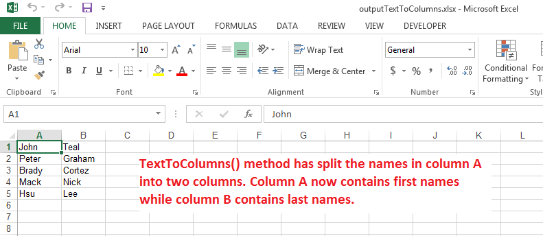

## **Possible Usage Scenarios**
You can convert your Text to Columns using Microsoft Excel. This feature is available from *Data Tools* under the *Data* tab. In order to split the contents of a column to multiple columns, the data should contain a specific delimiter such as a comma (or any other character) based on which Microsoft Excel splits the contents of a cell to multiple cells. Aspose.Cells also provides this feature via [TextToColumns](https://apireference.aspose.com/java/cells/com.aspose.cells/cells#textToColumns\(int,%20int,%20int,%20com.aspose.cells.TxtLoadOptions\)) method.
## **Convert Text to Columns using Aspose.Cells**
The following sample code explains the usage of the [TextToColumns](https://apireference.aspose.com/java/cells/com.aspose.cells/cells#textToColumns\(int,%20int,%20int,%20com.aspose.cells.TxtLoadOptions\)) method. The code first adds some people names in column A of the first worksheet. The first and last name is separated by space character. Then it applies the [TextToColumns](https://apireference.aspose.com/java/cells/com.aspose.cells/cells#textToColumns\(int,%20int,%20int,%20com.aspose.cells.TxtLoadOptions\)) method on column A and saves it as output excel file. If you open the [output excel file](25395230.xlsx), you will see, first names are in column A while last names are in column B as shown in this screenshot.

## **Sample Code**

