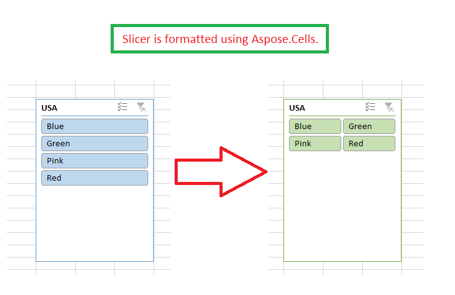

## **Possible Usage Scenarios**
You can format the slicer in Microsoft Excel by setting its number of columns or by setting its style etc. Aspose.Cells also allows you to do this using the [Slicer.NumberOfColumns](https://apireference.aspose.com/cells/java/com.aspose.cells/slicer#NumberOfColumns) and [Slicer.StyleType](https://apireference.aspose.com/cells/java/com.aspose.cells/slicer#StyleType) properties.
## **Formatting Slicer**
Please see the following code, it loads the [sample Excel file](67338501.xlsx) that contains a slicer. It accesses the slicer and sets its number of columns and style type and saves it as [output Excel file](67338500.xlsx). The screenshot shows how the slicer looks after the execution of the sample code.

## **Sample Code**

