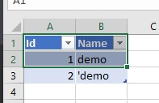

## **Show leading apostrophe in cells**

In Microsoft Excel, the leading apostrophe in the cell's value is hidden. Aspose.Cells provides the feature to display the apostrophe by default. For this, the API provides [**Workbook.Settings.QuotePrefixToStyle**](https://apireference.aspose.com/cells/java/com.aspose.cells/workbooksettings#QuotePrefixToStyle) property. This property indicates whether to set the [**QuotePrefix**](https://apireference.aspose.com/cells/java/com.aspose.cells/Style#QuotePrefix) property when entering string value starting with a single quote to the cell. Setting the [**Workbook.Settings.QuotePrefixToStyle**](https://apireference.aspose.com/cells/java/com.aspose.cells/workbooksettings#QuotePrefixToStyle) property to **false** will display the leading apostrophe in the output excel file.

The following screenshot shows the output excel file with the visible apostrophe.

The following code snippet demonstrates this by adding data with Smart Markers in the source excel file. The source and output excel files are attached for reference.

[Source File](AllowLeadingApostropheSample.xlsx)

[Output File](AllowLeadingApostropheSample_out.xlsx)

## **Sample Code**



The implementation of *DataObject* class is given below


