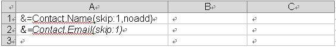
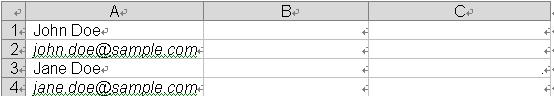
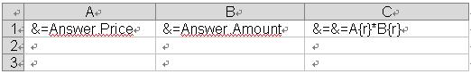
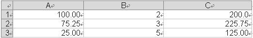

## **Introduction**
{} 

**Smart markers** are used to let Aspose.Cells know what information to place in a Microsoft Excel [designer spreadsheet](/cells/java/what-is-a-designer-spreadsheet/). Smart markers allow you to create templates that contain only relevant information and formatting.

{} 
## **Designer Spreadsheet & Smart Markers**
Designer spreadsheets are standard Excel files that contain visual formatting, formulas and smart markers. They can contain smart markers that reference one or more data source, such as information from a project and information for related contacts. Smart markers are written into the cells where you want information.

All smart markers start with &=. An example of a data marker is &=Party.FullName. If the data marker results in more than one item, for example, a complete row, then the following rows are moved down automatically to make room for the new information. Thus sub-totals and totals can be placed on the row immediately after the data marker to make calculations based on inserted data. To make calculations on the inserted rows, use [**dynamic formulas**](/cells/java/using-smart-markers/).

Smart markers consist of the **data source** and **field name** parts for most information. Special information may also be passed with variables and variable arrays. Variables always fill only one cell whereas variable arrays may fill several. Only use one data marker per cell. Unused smart markers are removed.

A smart marker may also contain parameters. Parameters allow you to modify how the information is laid out. They are appended to the end of the smart marker in parenthesis as a comma-separated list.
### **Smart Marker Options**
&=DataSource.FieldName 
&=[Data Source].[Field Name] 
&=$VariableName
&=$VariableArray
&==DynamicFormula
&=&=RepeatDynamicFormula
### **Parameters**
The following parameters are allowed:

- **noadd** - Do not add extra rows to fit data.
- **skip:n** - Skip n number of rows for each row of data.
- *ascending:n or descending:n - Sort data in smart markers. If n is 1, then the column is the first key of the sorter. The data is sorted after processing the data source. For example: &=Table1.Field3(ascending:1).
- **horizontal** - Write data left-to-right, instead of top-to-bottom.
- **numeric** - Convert text to number if possible.
- **shift** - Shift down or right, creating extra rows or columns to fit data. The shift parameter works the same way as in Microsoft Excel. For example in Microsoft Excel, when you select a range of cells, right-click and select **Insert** and specify **shift cells down**, **shift cells right** and other options. In short, the shift parameter fills the same function for vertical/normal (top to bottom) or horizontal (left to right) smart markers.
- **bean** - Indicates the data source is a simple POJO. Only supported in the Java API.

The parameters noadd and skip can be combined to insert data on alternating rows. Because the template is processed from the bottom to the top, you should add noadd on the first row to avoid extra rows from being inserted before the alternate row.

If you have multiple parameters, separate them with a comma, but no space: parameterA,parameterB,parameterC

The following screenshots show how to insert data on every other row.

**becomes...** 

### **Dynamic Formulas**
Dynamic formulas allow you to insert Excel formulas into cells even when the formula references rows that will be inserted during the export process. Dynamic formulas can repeat for each inserted row or use only the cell where the data marker is placed.

Dynamic formulas allow the following additional options:

- r - Current row number.
- 2, -1 - Offset to current row number.

The following illustrates a repeating dynamic formula and the resulting Excel worksheet.

**becomes…**

Cell C1 contains the formula =A1*B1, C2 contains = A2*B2 and C3 = A3*B3.

It's very easy to process the smart markers. The following code snippet shows how it is done.


## **Using Variable Arrays**
The following example code shows how to use variable arrays in Smart Markers. We place a variable array marker into A1 cell of the first worksheet of the workbook dynamically which contains a string of values which we set for the marker, process the markers to fill data into the cells against the marker. Finally, we save the Excel file.


## **Grouping Data**
In some Excel reports you might need to break the data into groups to make it easier to read and analyze. One of the primary purposes for breaking data into groups is to run calculations (perform summary operations) on each group of records.

Aspose.Cells smart markers allow you to group data by fields set and place summary rows in between data sets or data groups. For example, if grouping data by Customers.CustomerID, you can add a summary record every time the group changes.
### **Parameters**
Following are some smart marker parameters used for grouping data.
#### **group:normal/merge/repeat**
We support three types of group that you can choose between.

- **normal** - The group by field(s) value is not be repeated for the corresponding records in the column; instead they are printed once per data group.
- **merge** - The same behavior as for the normal parameter, except that it merges the cells in the group by field(s) for each group set.
- **repeat** - The group by field(s) value is repeated for the corresponding records.

For example: &=Customers.CustomerID(group:merge)
#### **skip**
Skips a specific number of rows after each group.

For example &=Employees.EmployeeID(group:normal,skip:1)
#### **subtotalN**
Performs a summary operation for a specified field data related to a group by field. The N represents numbers between 1 and 11 which specify the function used when calculating subtotals within a list of data. (1=AVERAGE, 2=COUNT, 3=COUNTA, 4=MAX, 5=MIN,...9=SUM etc.) Refer to the Subtotal reference in Microsoft Excel's help for further details.

The format actually states as:
subtotalN:Ref where Ref refers to the group by column.

For example,

- &=Products.Units(subtotal9:Products.ProductID) specifies summary function upon **Units** field with respect to the **ProductID** field in the **Products** table.
- &=Tabx.Col3(subtotal9:Tabx.Col1) specifies summary function upon the **Col3** field group by **Col1** in the table **Tabx**.
- &=Table1.ColumnD(subtotal9:Table1.ColumnA&Table1.ColumnB) specifies summary function upon **ColumnD** field group by **ColumnA** and **ColumnB** in table **Table1**.
## **Using Nested Objects**
Aspose.Cells supports nested objects in smart markers, the nested objects should be simple.

We use a simple template file. See the designer spreadsheet that contains some nested smart markers.

**The first worksheet of the designer file showing nested smart markers.** 

The example that follows shows how this works. Running the code below results in the output below.

**The first worksheet of the output file showing the resultant data.** 




## **Using Generic List as Nested Object**
Aspose.Cells now also supports using a generic list as a nested object. Please check the screenshot of the output excel file generated with the following code. As you can see in the screenshot a husband object contains multiple nested wife objects.






## **Using HTML property of Smart Markers**
The following sample code explains the use of the HTML property of the Smart Markers. When it will be processed, it will show "World" in "Hello World" as bold because of HTML <b> tag.


## **Getting Notifications while Merging Data with Smart Markers**
Sometimes, it may be required to get the notifications about the cell reference or the particular Smart Marker being processed before the completion. This can be achieved using the [WorkbookDesigner.CallBack](https://apireference.aspose.com/java/cells/com.aspose.cells/workbookdesigner#CallBack) property and [ISmartMarkerCallBack](https://apireference.aspose.com/java/cells/com.aspose.cells/ISmartMarkerCallBack)

For sample code and detail explanation, please see this article.

- [Getting Notifications while Merging Data with Smart Markers](/cells/java/getting-notifications-while-merging-data-with-smart-markers/)
