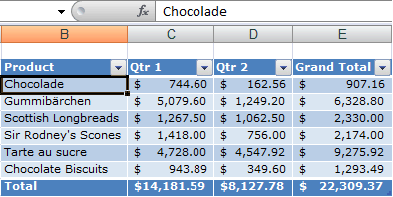
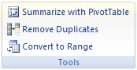

{} 

Sometimes you create a table in Microsoft Excel and do not want to keep working with the table functionality that it comes with. Instead, you want something that looks like a table. To keep data in a table without losing formatting, convert the table to a regular range of data.

Aspose.Cells does support this feature of Microsoft Excel for tables and list-objects.

{} 
#### **Using Microsoft Excel**
Use the **Convert to Range** feature to quickly convert a table to a range without losing formatting. In Microsoft Excel 2007/2010:

1. Click anywhere in the table to make sure that the active cell is in a table column.

1. On the **Design** tab, in the **Tools** group, click **Convert to Range**. 

{} 

The table features are no longer available after the table has been converted to a range. For example, row headers no longer include the sort and filter arrows, and structured references (references that use table names) that were used in formulas turn into regular cell references.

{} 
#### **Using Aspose.Cells**


#### **Convert Table to Range with Options**
Aspose.Cells provides additional options while converting Table to Range through the [TableToRangeOptions](https://apireference.aspose.com/java/cells/com.aspose.cells/TableToRangeOptions) class. The [TableToRangeOptions](https://apireference.aspose.com/java/cells/com.aspose.cells/TableToRangeOptions) class provides [LastRow](https://apireference.aspose.com/java/cells/com.aspose.cells/tabletorangeoptions#LastRow) property which allows you to set the last index of the table row. The table formatting will be retained up to the specified row index and the rest of the formatting will be removed.

The sample code given below demonstrates the use of [TableToRangeOptions](https://apireference.aspose.com/java/cells/com.aspose.cells/TableToRangeOptions) class.



