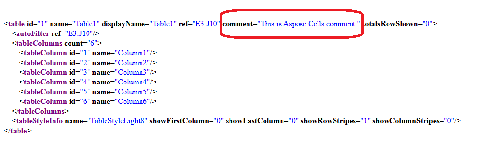

#### **Set the Comment of Table or List Object inside the Worksheet**
Please set the comment of the Table or List Object inside the worksheet using the [ListObject.Comment](https://apireference.aspose.com/java/cells/com.aspose.cells/listobject#Comment) property. The comment will be visible inside the xl/tables/tableName.xml file.

The following sample code loads the [source excel file](attachments/5276080/5472561.xlsx), sets the comment of the first table or list object inside the worksheet and the screenshot shows the comment created by this code in the red rectangle.


