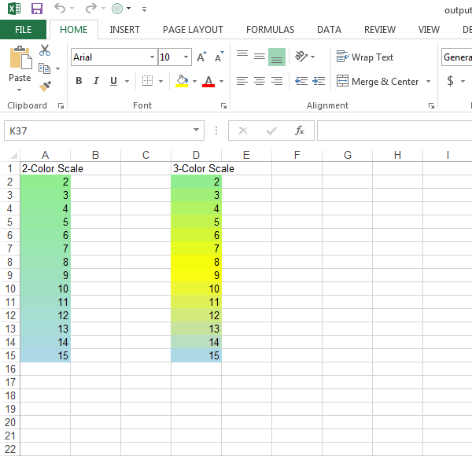

{} 

**2-Color Scale** and **3-Color Scale** Conditional Formattings are added in the same way except they are differed by [FormatCondition.ColorScale.Is3ColorScale](https://apireference.aspose.com/java/cells/com.aspose.cells/colorscale#Is3ColorScale) property. This property is **false** for 2-Color Scale and **true** for 3-Color Scale Conditional Formattings.

{} 
#### **Adding 2-Color Scale and 3-Color Scale Conditional Formattings**
The following sample code adds 2-Color and 3-Color Scale Conditional Formattings. It generates the [output excel file](5472511.xlsx) as shown below.


