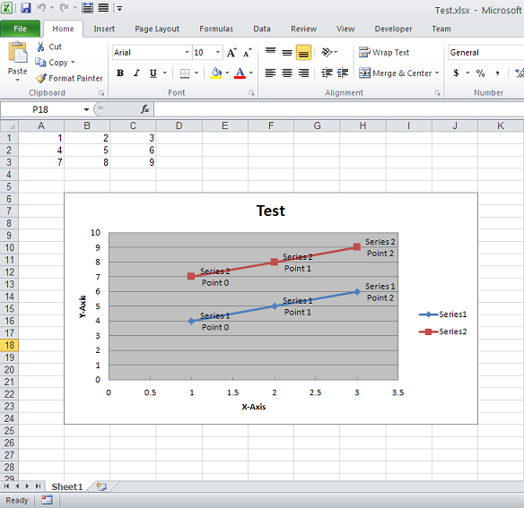

{} 

You can add custom labels to data points in the series of the chart. Aspose.Cells provides [ChartPoint.getDataLabels().setText()](https://apireference.aspose.com/java/cells/com.aspose.cells/datalabels#Text) property to add these custom labels. This article will explain how to use this property to add custom labels to data points in the series of the chart.

{} 
## **Adding Custom Labels to Data Points in the Series of the Chart**
The following code creates Scatter Chart Connected By Lines With Data Markers and then adds Custom Labels to the Data Points in the Series of the Chart. Each custom label shows Series Name and Point Name. You can use any other text instead of it. After the execution of the code, the following Excel file is created. As you can see inside the Chart, each DataPoint has Custom Label set.


