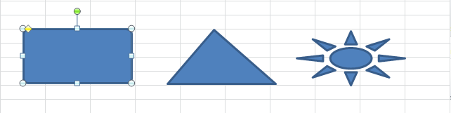
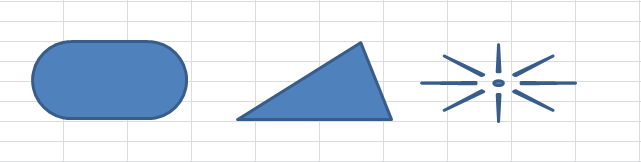

{} 

Aspose.Cells provides [Shape.getGeometry().getShapeAdjustValues()](https://apireference.aspose.com/java/cells/com.aspose.cells/geometry#ShapeAdjustValues) property to make changes to the adjustment points with shapes. In the Microsoft Excel UI, adjustments display as yellow diamond nodes. For example:

- Rounded Rectangle has an adjustment to change the arc
- Triangle has an adjustment to change the location of the point
- A trapezoid has an adjustment to change the width of the top
- Arrows have two adjustments to change the shape of the head and tail

This article will explain the use of [Shape.getGeometry().getShapeAdjustValues()](https://apireference.aspose.com/java/cells/com.aspose.cells/geometry#ShapeAdjustValues) property to change the adjustment value of the different shapes.

{} 
## **Change Adjustment Values of the Shape**
The following sample code accesses first three shapes of the first worksheet in the source excel file and then changes the adjustment values of the shapes. Below screenshots show how the shapes look before changing adjustment values and then after changing adjustment values.
### **Drawing Shapes Before Changing Adjustment Values**

### **Drawing Shapes After Changing Adjustment Values**


