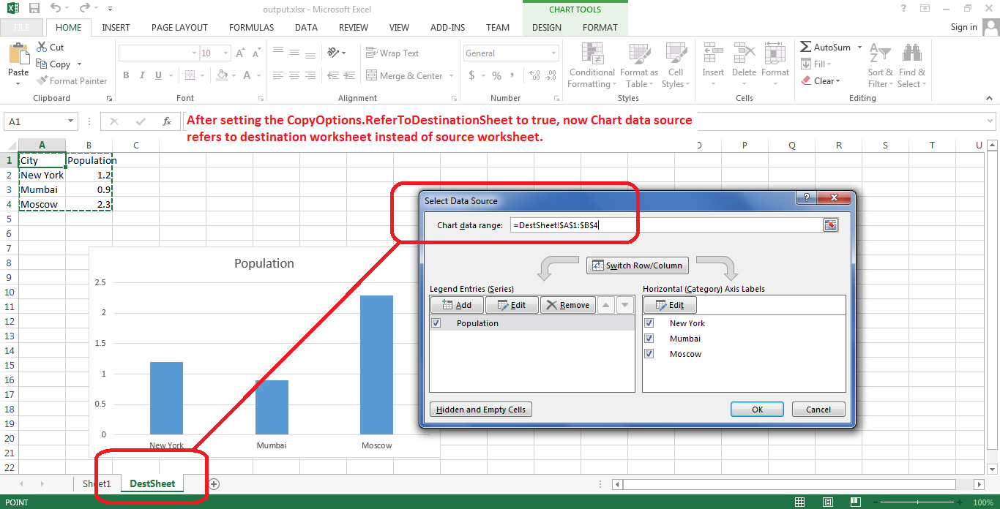

## **Possible Usage Scenarios**
When you copy rows or range which contains charts to new worksheet, then data source of chart does not change. For example, if the data source of chart is =Sheet1!$A$1:$B$4, then after copying rows or range to new worksheet, the data source will remain the same i.e =Sheet1!$A$1:$B$4. It still refers to old worksheet i.e. Sheet1. This is also the Microsoft Excel behavior. But if you want that it refers to new destination worksheet, then please use the CopyOptions.ReferToDestinationSheet property and set it true while calling the Cells.CopyRows() method. Now if your destination worksheet is DestSheet, then the data source of your chart will change from =Sheet1!$A$1:$B$4 to =DestSheet!$A$1:$B$4.
## **Change Data Source of the Chart to Destination Worksheet while Copying Rows or Range**
The following sample code explains the usage of CopyOptions.ReferToDestinationSheet property while copying rows or range containing chart to new worksheet. The code uses the [sample excel file](attachments/5275731/5472284.xlsx) and generates the [output excel file](attachments/5275731/5472283.xlsx). The screenshot shows that the data source of chart in [output excel file](attachments/5275731/5472283.xlsx) now refers to DestSheet instead of Sheet1.



