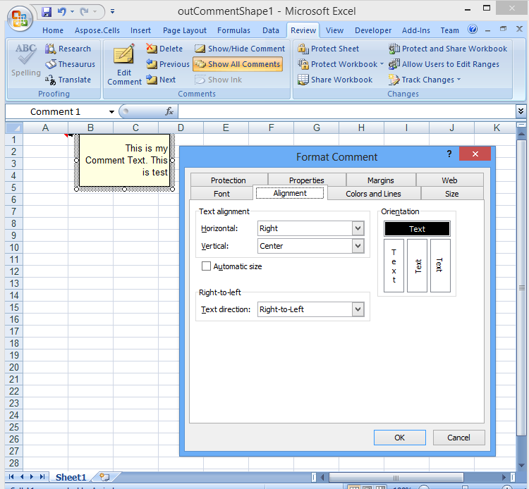

{} 

Microsoft Excel users can add comments to cells in spreadsheets to add additional information to cells and highlight the data. Developers might need to customize the comment to specify alignment settings and text direction. Aspose.Cells provides APIs to accomplish the task.

{} 

Aspose.Cells provides a [Shape.setTextDirection()](https://apireference.aspose.com/java/cells/com.aspose.cells/shape#TextDirection) method to set the desired text direction for a comment.

The following image shows the comment with its format settings in Microsoft Excel. The output file is obtained after running the below code segment.

**Comment with right-to-left text direction** 


