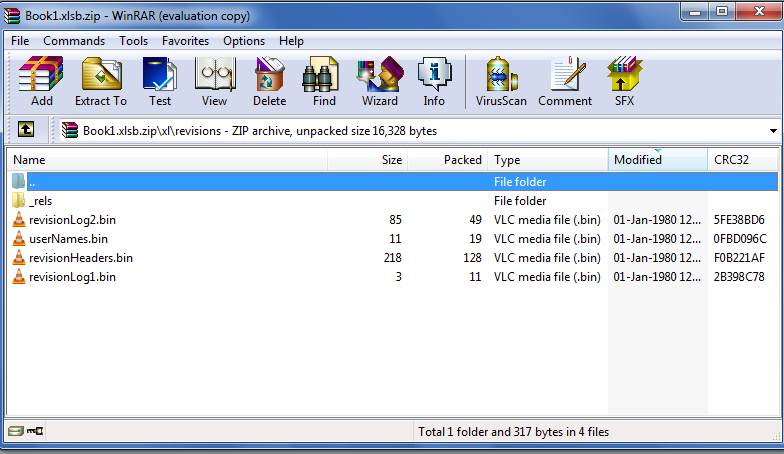
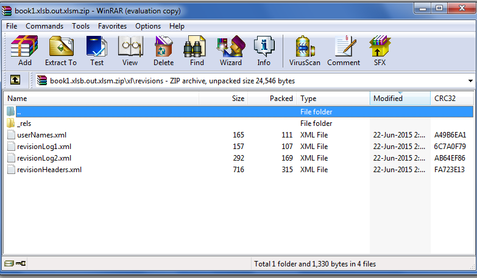

{} 

Aspose.Cells now supports to fully convert revisions of XLSB file into XLSM file. Revisions are found inside the path \xl\revisions. You can view them by changing your XLSB file extension to ZIP. The \xl\revisions path contains files ending with .bin extensions.

When you convert your XLSB file into XLSM file using Aspose.Cells, these .bin files successfully converts to .xml files as shown in these two screenshots.

{} 
#### **Convert Revision of XLSB to XLSM**
The following screenshot shows the .bin files inside the path \xl\revisions of the XLSB file.

The following screenshot shows how .bin files have been converted into .xml files when the XLSB file is converted to XLSM format using Aspose.Cells.

Here is the code to convert the XLSB file into XLSM format using Aspose.Cells.


