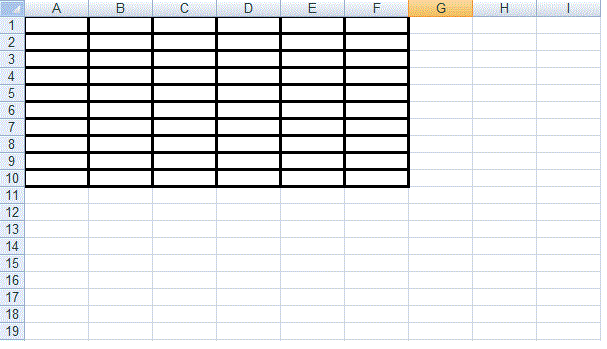

{}

Sometimes, you want to create a table by adding border lines for a **Range**/**CellArea** based on the address of the cells you have. You can use [**Cells.createRange**](https://apireference.aspose.com/cells/java/com.aspose.cells/cells#createRange(int,%20int,%20boolean)) method to create a range of cells. The [**Cells.createRange**](https://apireference.aspose.com/cells/java/com.aspose.cells/cells#createRange(int,%20int,%20boolean)) method returns a [**Range**](https://apireference.aspose.com/cells/java/com.aspose.cells/Range) object. You can create a [**Style**](https://apireference.aspose.com/cells/java/com.aspose.cells/Style) object and specify the borders (top, left, bottom, right) options accordingly. Later, you may get the cells of the [**Range**](https://apireference.aspose.com/cells/java/com.aspose.cells/Range) and apply your desired formatting to the cells.

{}

The following example shows how to create a [**Range**](https://apireference.aspose.com/cells/java/com.aspose.cells/Range) and specify the borderlines for the range cells.



After running the above code, we can have the generated excel file containing the formatted table; here is the screenshot of the file.

