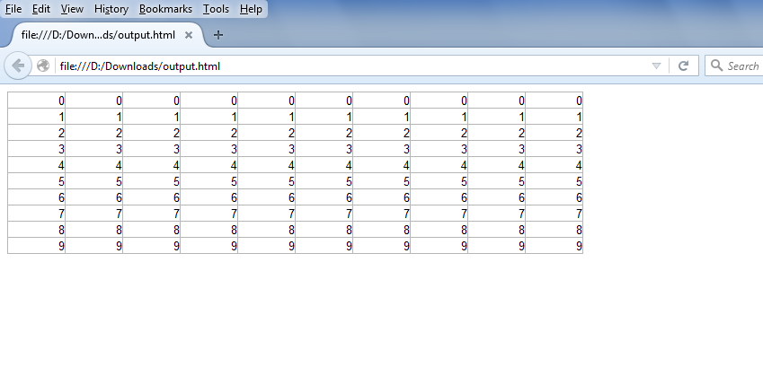

{} 

If you want to export your Excel file into HTML with GridLines, then please use the [HtmlSaveOptions.ExportGridLines](https://apireference.aspose.com/cells/java/com.aspose.cells/htmlsaveoptions#ExportGridLines) property and set it **true**.

{} 
## **Export Excel to HTML with GridLines**
The following sample code creates a workbook and fills its worksheet with some values and then saves it in HTML format after setting the [HtmlSaveOptions.ExportGridLines](https://apireference.aspose.com/cells/java/com.aspose.cells/htmlsaveoptions#ExportGridLines) to **true**.

The following screenshot shows the output HTML generated with this sample code. As you can see, it also displays gridlines in output HTML.


