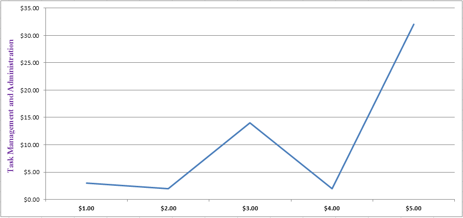
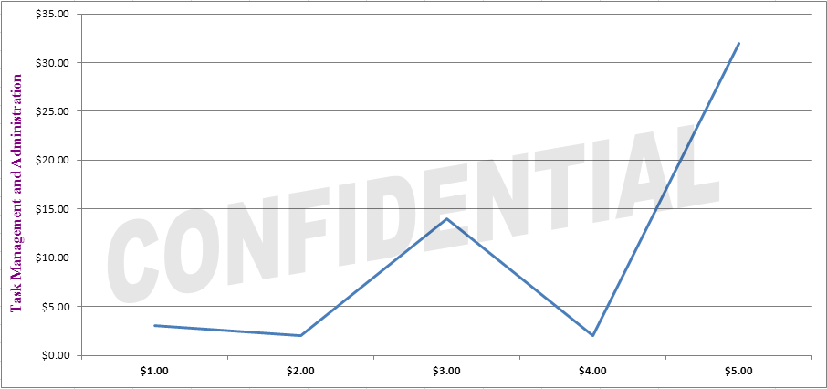

{} 

You can use WordArt to add special text effects to spreadsheets. For example, stretch a title, decorate text, make the text fit a preset shape, or apply the affected text to a chart’s plot area as a watermark. The WordArt becomes an object that you can move or position in your spreadsheets to add decoration.

The following example shows how to add a WordArt shape as a watermark for the chart plot area.

{} 
### **Adding WordArt Watermark to Chart**
The following example shows how to add a WordArt shape as a watermark for an existing chart’s plot area. The example uses a template Excel file that already contains the chart.

**The input file** 

**The ouptput file** 


