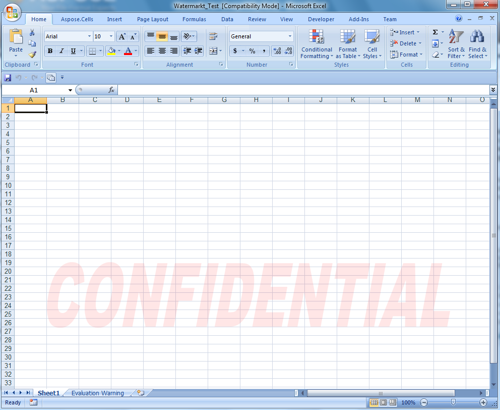

{} 

Use WordArt to add special text effects to spreadsheets. For example, stretch a title across the top of the file, decorate text, and make the text fit a preset shape, or apply the text to an Excel sheet as A background watermark. The WordArt becomes an object that you can move or position in spreadsheets to add decoration.

{} 
#### **Adding WordArt Watermark to Worksheet**
The following example shows how to add a WordArt shape to set a background watermark for a worksheet.

After running the code the output file contains a pale red WordArt watermark.

**The output file** 


