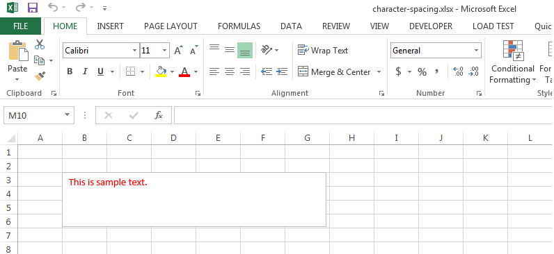
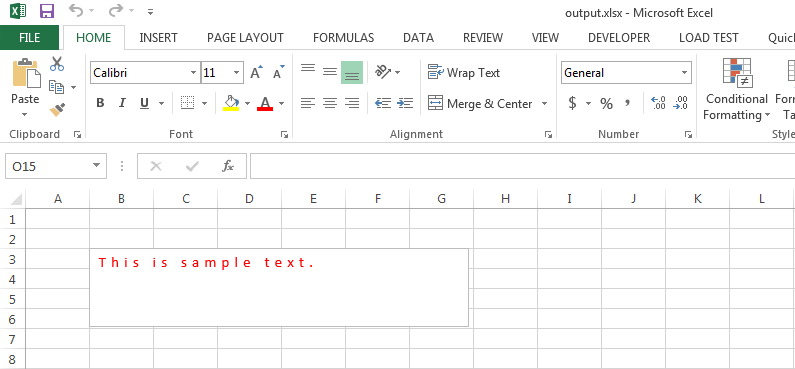

{} 

You can change the character spacing of excel textbox or shape using the [FontSetting.TextOptions.Spacing](https://apireference.aspose.com/cells/java/com.aspose.cells/textoptions#Spacing) property.

{} 
## **Change Character Spacing of Excel TextBox or Shape**
The following sample code changes the character spacing of the text box in an excel file to point 4 and then saves it on disk.

The following screenshot shows how the [sample excel file](5473426.xlsx) looks before the execution of the code.

The following screenshot shows how the [output excel file](5473425.xlsx) looks after the execution of the code.


