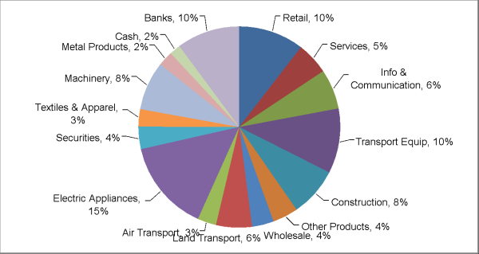

{} 

This article explains how to create a pie chart with leader lines from scratch while using Aspose.Cells for Java API. In Excel, the 'Show leader lines' option is set by default so when you create a pie chart in Excel the leader lines are shown. However, while creating a similar chart with Aspose.Cells APIs, you have to explicitly set the [Series.HasLeaderLines](https://apireference.aspose.com/java/cells/com.aspose.cells/series#HasLeaderLines) property.

{} 
### **Creating Pie Chart with Leader Lines**
In order to demonstrate the usage of Aspose.Cells for Java API to create a pie chart with leader lines, we will first create a new [Workbook](https://apireference.aspose.com/java/cells/com.aspose.cells/Workbook) and input some data that will serve as series data source. Once the data is in place, we will add a [Chart](https://apireference.aspose.com/java/cells/com.aspose.cells/Chart) of type [Pie](https://apireference.aspose.com/java/cells/com.aspose.cells/charttype#PIE) to the collection of charts and set it's different aspects to get the desired chart view.



**Resultant Pie Chart** 

