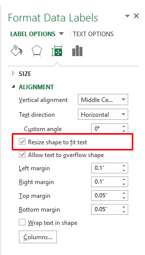
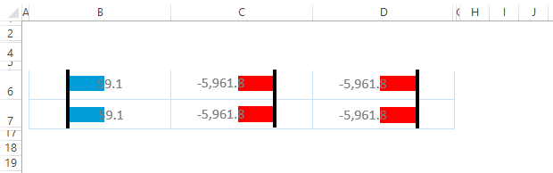
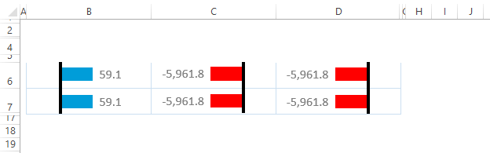

{}

Excel application provides the **Resize shape to fit text** option for Chart's DataLabels in order to increase the size of the shape so that the text fits inside of it. This option can be accessed on Excel interface by selecting any of the data labels on the chart. Right click and select **Format DataLabels** menu. On **Size & Properties** tab, expand **Alignment** to reveal the related properties including the **Resize shape to fix text** option.

{}

## **Resize Chart's Data Label Shape To Fit Text**

In order to mimic Excel's feature of resizing data label shapes to fit the text, the Aspose.Cells APIs have exposed the Boolean type [**DataLabels.ResizeShapeToFitText**](https://apireference.aspose.com/cells/java/com.aspose.cells/datalabels#IsResizeShapeToFitText) property. The following piece of code shows the simple usage scenario of [**DataLabels.ResizeShapeToFitText**](https://apireference.aspose.com/cells/java/com.aspose.cells/datalabels#IsResizeShapeToFitText) property.

The chart looks as follows before executing the code.



The chart looks as follows after executing the code.

