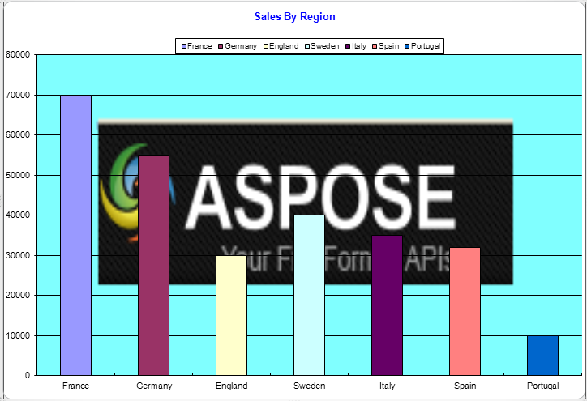

{} 

Aspose.Cells allows you to set a gradient, texture, pattern or picture as fill effects for different objects, such as the plot area, chart area, or legend box of a chart. This document shows how to add an image to a chart's background.

{} 

The following chart is created with the sample code.

**Output chart** 


