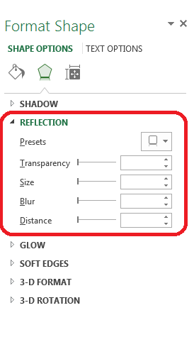

## **Possible Usage Scenarios**
Aspose.Cells provides the [Shape.ReflectionEffect](https://apireference.aspose.com/cells/java/com.aspose.cells/shape#Reflection) property to work with the reflection effect of shape or chart. It contains the following sub-properties which you can set to achieve different results as per your requirements.

- [ReflectionEffect.Blur](https://apireference.aspose.com/cells/java/com.aspose.cells/reflectioneffect#Blur)
- [ReflectionEffect.Direction](https://apireference.aspose.com/cells/java/com.aspose.cells/reflectioneffect#Direction)
- [ReflectionEffect.Distance](https://apireference.aspose.com/cells/java/com.aspose.cells/reflectioneffect#Distance)
- [ReflectionEffect.FadeDirection](https://apireference.aspose.com/cells/java/com.aspose.cells/reflectioneffect#FadeDirection)
- [ReflectionEffect.RotWithShape](https://apireference.aspose.com/cells/java/com.aspose.cells/reflectioneffect#RotWithShape)
- [ReflectionEffect.Size](https://apireference.aspose.com/cells/java/com.aspose.cells/reflectioneffect#Size)
- [ReflectionEffect.Transparency](https://apireference.aspose.com/cells/java/com.aspose.cells/reflectioneffect#Transparency)
- [ReflectionEffect.Type](https://apireference.aspose.com/cells/java/com.aspose.cells/reflectioneffect#Type)

The following screenshot shows the Microsoft Excel interface to set the *Reflection Effect* of Shape.

## **Working with the Reflection Effect of Shape or Chart**
The following sample code loads the [source excel file](5472529.xlsx) and accesses the first shape in the first worksheet and sets the sub-properties of [Shape.ReflectionEffect](https://apireference.aspose.com/cells/java/com.aspose.cells/shape#Reflection) property and then saves the workbook in the [output excel file](5472539.xlsx).
## **Sample Code**

