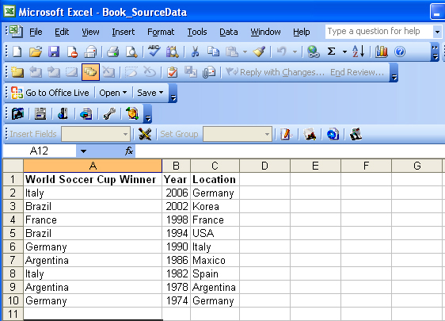
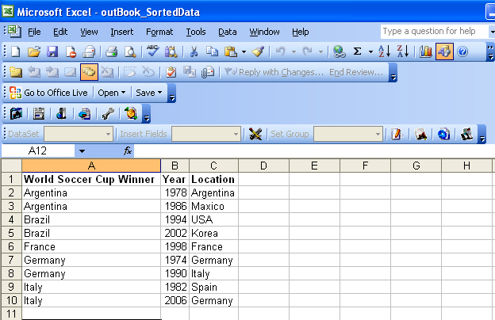

{}

This article is designed to provide developers with detailed understanding of how to sort data in a worksheet.

Data sorting is a handy and versatile feature of Microsoft Excel. Generally, sorting is performed on a list, which is defined as a contiguous group of data where the data is displayed in columns. Aspose.Cells allows you to sort worksheet data alphabetically or numerically. It sorts data in the same way as Microsoft Excel does.

You might work with Office Automation for data sorting but Office Automation has its drawbacks. There are several reasons and issues involved: security, stability, scalability/speed, price, and features. In short, there are many reasons to look for a different solution, with the top one being that Microsoft themselves strongly recommends against Office Automation from software solutions.

In this article, we create a console application, and sort data with a few simple lines of code using the Aspose.Cells API.

{}

## **Using Aspose.Cells to Sort Data in a Worksheet**

1. Create a Microsoft Excel file with different data sets or contents.
   I created a new workbook in Microsoft Excel and added sample data into cells on the first worksheet.
   **The template worksheet created in Microsoft Excel**

1. Download and install Aspose.Cells:
   1. [Download](https://downloads.aspose.com/cells/java) Aspose.Cells for Java.
   1. Install it on your development computer.

{}

All [Aspose](http://www.aspose.com/) components, when installed, work in evaluation mode. The evaluation mode has no time limit and it only injects watermarks into produced documents.

{}

1. Create a project.
   Create a new console application in an editor or Notepad.
1. Add a class path.
   To set a Class Path using Eclipse:
   1. Extract the Aspose.Cells.jar and dom4j_1.6.1.jar from Aspose.Cells.zip.
   1. Set the classpath of project in Eclipse:
   1. Select your project in Eclipse and then click menus Project-Properties.
   1. Select "Java Build Path" in the left side of the popup window, then select the "Libraries" tab, click "Add JARs" or "Add External JARs" to select Aspose.Cells.jar and dom4j_1.6.1.jar and add them into build paths.
   1. write application to invoke APIs of Aspose's components.
      Or you set it at runtime at the DOS prompt in Windows.



 javac -classpath %classpath%;e:\Aspose.Cells.jar;  ClassName .javajava -classpath %classpath%;e:\Aspose.Cells.jar;  ClassName



1. Sort the data in the worksheet:
   1. Add code to the project.



1. Execute the program.

When the above code is executed, the data is sorted:

**Output file** 

## **Conclusion**

{}

In this article I have shown how we can sort data using Aspose.Cells. Hopefully, you will be able to adapt these options to your own scenarios.

Aspose.Cells offer more flexibility than other components and provides outstanding speed, efficiency and reliability. Aspose.Cells benefits from years of research, design and careful tuning.

We heartily welcome your queries, comments and suggestions at [Aspose.Cells Forum](https://forum.aspose.com/c/cells/9). We warranty a prompt reply.

{}
