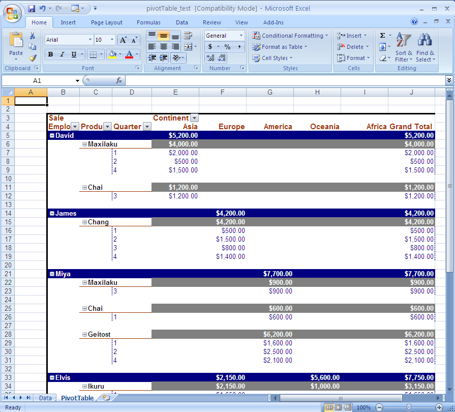

{}

A pivot table is an interactive summary of records. For example, you may have hundreds of invoice entries in a list in a worksheet. A pivot table can total the invoices by customer, product or date. With Microsoft Excel it is possible to quickly re-arrange the information in the pivot table by dragging buttons to a new position.

A pivot chart is an interactive graphical representation of the data in a pivot table. Pivot charts were introduced in Excel 2000. Using a pivot chart makes it even easier to understand the data since the pivot table creates subtotals and totals automatically.

Aspose.Cells supports [pivot tables](/cells/java/create-pivot-tables-and-pivot-charts/#creating-a-pivot-table) and [pivot charts](/cells/java/create-pivot-tables-and-pivot-charts/#creating-a-pivot-chart-based-on-the-pivot-table).

{}

## **Adding Pivot Tables and Charts**

Aspose.Cells provides a special set of classes used to create pivot tables. These classes are used to create and set PivotTable objects, which act as a PivotTable object's basic building blocks:

- PivotField, a field in a pivot table report.
- PivotFields, a collection of all the PivotField objects in a pivot table.
- PivotTable, a PivotTable report on a worksheet.
- PivotTables, a collection of all the PivotTable objects on the worksheet.

### **Preparing to use Aspose.Cells**

1. Download and install Aspose.Cells.Zip:
   1. [Download Aspose.Cells for Java](https://downloads.aspose.com/cells/java).
   1. Unzip it on your development computer.
      All [Aspose](http://www.aspose.com/) components, when installed, work in evaluation mode. The evaluation mode has no time limit and it only injects watermarks into produced documents.
1. Create a project
   1. You can either create a project using some Java Editor e.g. Eclipse or create a simple program using a NotePad.
1. Add class path:
   To set a class path using Eclipse:
   1. Extract the Aspose.Cells.jar and dom4j_1.6.1.jar from Aspose.Cells.zip.
   1. Set the classpath of project in Eclipse:
   1. Select your project in Eclipse and then click menus Project-Properties.
   1. Select "Java Build Path" in the left side of the popup window, then select the "Libraries" tab, click "Add JARs" or "Add External JARs" to select Aspose.Cells.jar and dom4j_1.6.1.jar and add them into build paths.
   1. Write application to invoke APIs of Aspose's components.
      Or you may set it at runtime at dos prompt in Windows.



 javac \-classpath %classpath%;e:\Aspose.Cells.jar; ClassName .javajava \-classpath %classpath%;e:\Aspose.Cells.jar; ClassName 



### **Creating a Pivot Table**

To create a pivot table using Aspose.Cells:

1. Add some data to a worksheet cells using a Cell object's PutValue/setValue method. You also use a template file already filled with data. The data will be used as the pivot table's data source.
1. Add a pivot table to the worksheet by calling the PivotTables collection's add method (encapsulated in the Worksheet object).
1. Access the new PivotTable object from the PivotTables collection by passing its index.
1. Use any of the pivot table objects encapsulated in the PivotTable object to manage the table.

A code sample is given below. Executing the code generates a new file: pivotTable_test.xls.

**Input data** 

**The output pivot table**



### **Creating a Pivot Chart based on the Pivot Table**

To create a pivot chart using Aspose.Cells:

1. Add a chart.
1. Set the PivotSource of the chart to refer to an existing pivot table in the spreadsheet.
1. Set other attributes.

Below is the code used by the component to accomplish the task. Executing the code generates a new file: pivotChart_test.xls.

**The pivot chart sheet**



{}

This article shows how to create pivot tables and pivot charts using Aspose.Cells. Hopefully, it will help you use these features in your own scenarios.

Aspose.Cells has benefited from years of research, design and careful tuning.

We welcome your queries, comments and suggestions at [Aspose.Cells Forum](https://forum.aspose.com/c/cells/9). We warranty a prompt reply.

{}

## Related Articles

- [Custom sorting in Pivot Table](/cells/java/custom-sorting-in-pivot-table/)
- [Formatting Pivot Table](/cells/java/formatting-pivot-table/)
- [Refresh and Calculate Pivot Table having Calculated Items](/cells/java/refresh-and-calculate-pivot-table-having-calculated-items/)
- [Disable Pivot Table Ribbons](/cells/java/disable-pivot-table-ribbons/)
