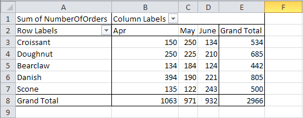
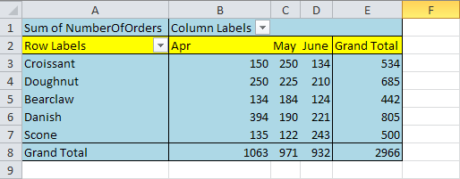

{}

Sometimes, you want to format pivot table cells. For example, you want to apply a background color to pivot table cells. Aspose.Cells provides two methods [**PivotTable.formatAll()**](https://apireference.aspose.com/cells/java/com.aspose.cells/pivottable#formatAll(com.aspose.cells.Style)) and [**PivotTable.format()**](https://apireference.aspose.com/cells/java/com.aspose.cells/pivottable#format(int,%20int,%20com.aspose.cells.Style)), which you can use for this purpose.

[**PivotTable.formatAll()**](https://apireference.aspose.com/cells/java/com.aspose.cells/pivottable#formatAll(com.aspose.cells.Style)) applies the style to the entire pivot table while [**PivotTable.format()**](https://apireference.aspose.com/cells/java/com.aspose.cells/pivottable#format(int,%20int,%20com.aspose.cells.Style)) applies the style to a single cell of the pivot table.

{}

The following sample code formats the entire pivot table with a light blue color and then formats the second table row yellow.

**The input pivot table, before executing the code**

**The ouput pivot table, after the executing the code**


