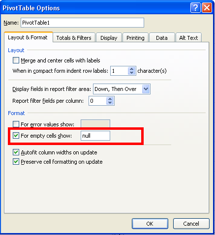

{}

You can set different pivot table options using Aspose.Cells. One such option is "For empty cells show". Setting this option means that all empty cells in the pivot table are displayed with a specified string.

To find and set this option in Microsoft Excel:

1. Select a pivot table and right-click it.
1. Select **PivotTable Options**.
1. Select the **Layout & Format** tab.
1. Select the **For empty cells show** option and specify a string.

{}

Aspose.Cells provides the [**PivotTable.setDisplayNullString()**](https://apireference.aspose.com/cells/java/com.aspose.cells/pivottable#DisplayNullString) and [**PivotTable.setNullString()**](https://apireference.aspose.com/cells/java/com.aspose.cells/pivottable#NullString) properties for setting the "For empty cells show" pivot table option.


