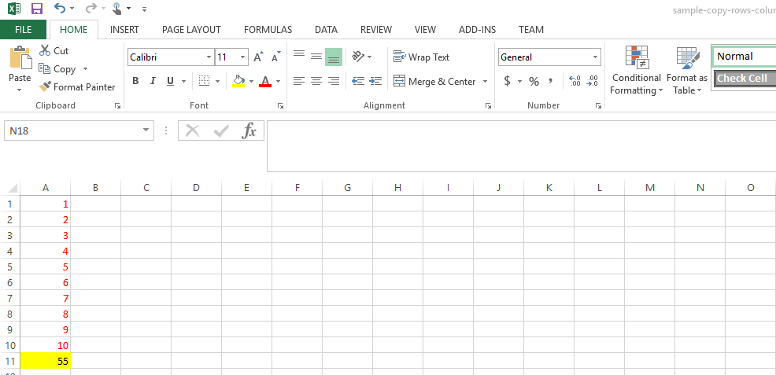
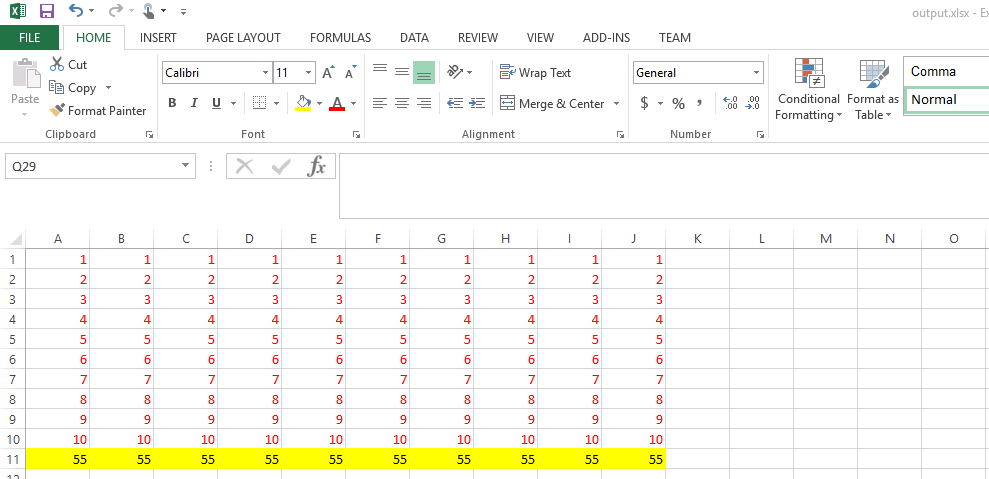
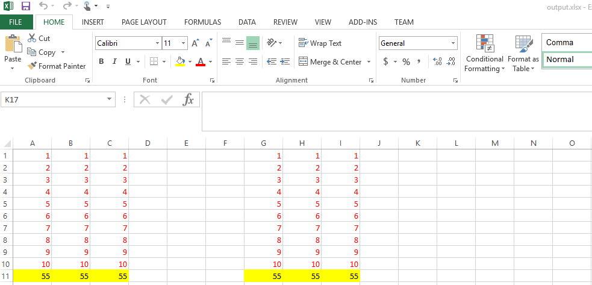

{}

Aspose.Cells APIs provide the facility to copy rows and columns within or between the workbooks. While copying row or column, all the data is copied along with the styling, formulas (with updated references) and resulting values, comments, cell styles, hidden cells, images, and drawing objects.

{}

## **Copying Rows**

### **Copying Single Row**

The following example shows how to copy a single row in a worksheet. The example uses a Microsoft Excel spreadsheet as input and copies the first row to the next 10 rows in the same worksheet.

Below is a snapshot of the input spreadsheet.



After executing the above code snippet, the resultant spreadsheet looks as follow.

### **Copying Multiple Rows**

You can also copy multiple rows onto a new destination while using the [**Cells.copyRows**](https://apireference.aspose.com/cells/java/com.aspose.cells/cells#copyRow(com.aspose.cells.Cells,%20int,%20int)) method which takes an additional parameter of type integer to specify the number of source rows to be copied.

Below is a snapshot of the input spreadsheet containing 3 rows of data whereas the code snippet provided below copies all 3 rows to a new location starting from 7th row.



Here is the resultant spreadsheet view after executing the above code snippet.

## **Copying Columns**

### **Copying Single Column**

The following example shows how to copy a column in a worksheet. This example uses an existing spreadsheet as input to the process and copies the first column to next 10 columns using two different approaches.

Here is how the input spreadsheet looks.



Here is the view of resultant spreadsheet after executing the above code snippet.

### **Copying Multiple Columns**

Similar to [**Cells.copyRows**](https://apireference.aspose.com/cells/java/com.aspose.cells/cells#copyRow(com.aspose.cells.Cells,%20int,%20int)) method, the Aspose.Cells APIs also provide the [**Cells.copyColumns**](https://apireference.aspose.com/cells/java/com.aspose.cells/cells#copyColumns(com.aspose.cells.Cells,%20int,%20int,%20int)) method in order to copy multiple source columns to a new location.



Here is how source and resultant spreadsheets look in Excel.

## Related Articles

- [Adjusting Row Height and Column Width](/cells/java/adjusting-row-height-and-column-width/)
- [Autofit Rows and Columns](/cells/java/autofit-rows-and-columns/)
- [Inserting and Deleting Rows and Columns](/cells/java/inserting-and-deleting-rows-and-columns/)
- [Hiding and Showing Rows and Columns](/cells/java/hiding-and-showing-rows-and-columns/)
