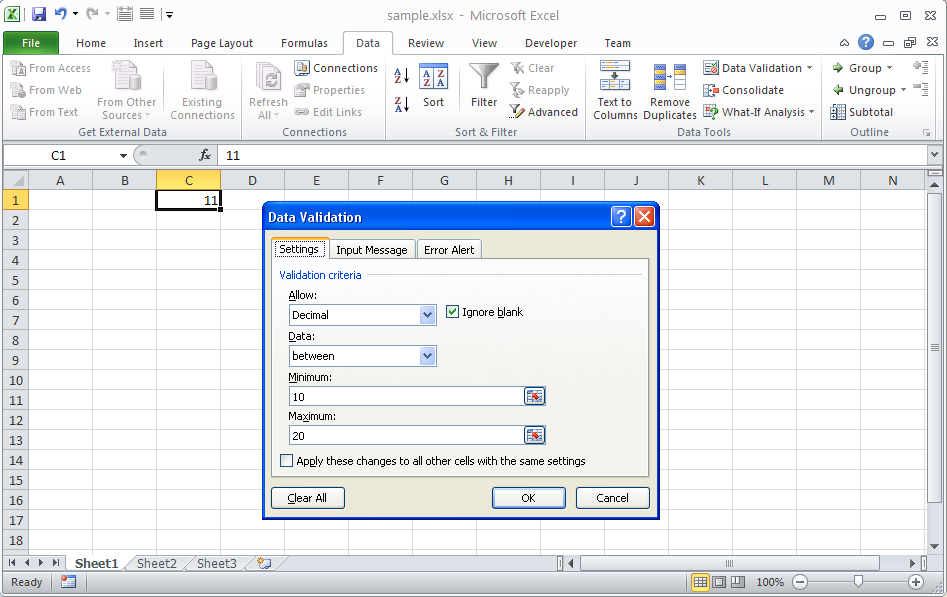

{} 

You can use Aspose.Cells API to get the validation applied to any cell. Aspose.Cells provides the [Cell.getValidation](https://apireference.aspose.com/java/cells/com.aspose.cells/cell#getValidation\(\)) method for this purpose. If there is no validation on the cell, it returns null. Similarly, you can use the [Worksheet.getValidations().getValidationInCell(int row, int column)](https://apireference.aspose.com/java/cells/com.aspose.cells/validationcollection#getValidationInCell\(int,%20int\)) method to acquire the validation applied to a cell by providing its row and column indices.

{} 

The following snapshot shows the sample Microsoft Excel file used in the sample code below. Cell **C1** has **decimal validation** applied and can only take values **between 10 and 20**.

**A cell with validation** 

The sample code below gets the validation applied to C1 and reads its various properties.



Here is the console output from the sample code executed with the sample file shown in the snapshot above.



 Reading Properties of Validation

\--------------------------------

Type: 2

Operator: 0

Formula1: =10

Formula2: =20

Ignore blank: true


