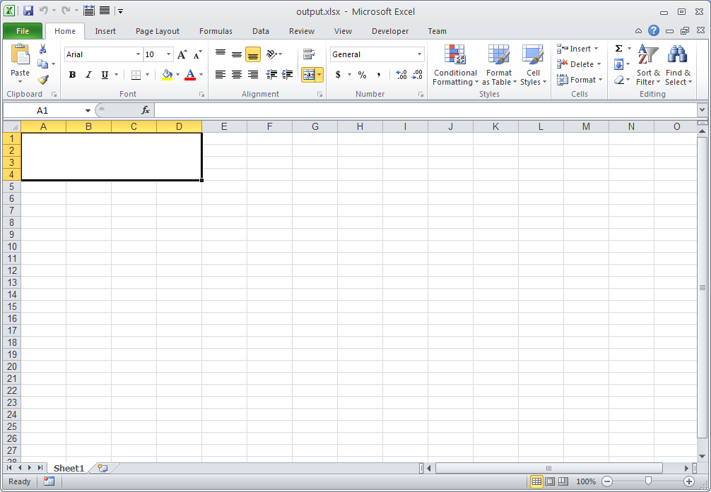

{}

You can use Aspose.Cells to merge or split a range of cells. Aspose.Cells provides the [**Range.merge()**](https://apireference.aspose.com/cells/java/com.aspose.cells/range#merge()) and [**Range.unMerge()**](https://apireference.aspose.com/cells/java/com.aspose.cells/range#unMerge()) methods for this purpose. This article explains how to merge a range of cells into a single cell.

{}

The following sample code first creates a range - A1:D4 - and then merges the cells in the range into a single cell using the [**Range.merge()**](https://apireference.aspose.com/cells/java/com.aspose.cells/range#merge()) method.
Similarly, it is possible to split cells by creating a range and calling the [**Range.unMerge()**](https://apireference.aspose.com/cells/java/com.aspose.cells/range#unMerge()) method.

The following image shows the output Excel file generated with the sample code. As you can see, the range A1:D4 has been merged into a single cell.



{}

## **Related Articles**

- [Merging and splitting cells](/cells/java/merging-and-unmerging-cells/).

{}
