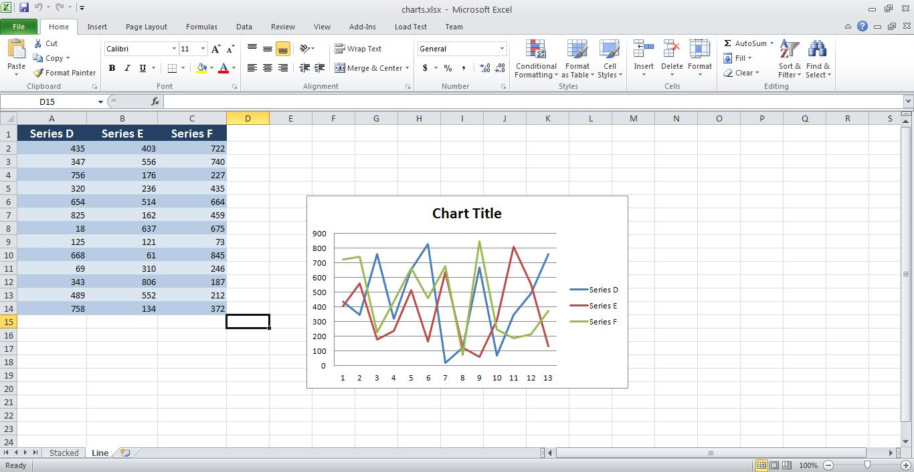

{} 

Sometimes, you need to combine workbooks with various content like images, charts, and data into a single workbook. Aspose.Cells supports this feature. This article shows how to create a simple application to combine workbooks with a few, simple lines of code using Aspose.Cells.

{} 
### **Combining Workbooks**
The example code combines two workbooks into a single workbook using Aspose.Cells for Java. The code loads the source workbooks, uses the [Workbook.combine()](https://apireference.aspose.com/java/cells/com.aspose.cells/workbook#combine\(com.aspose.cells.Workbook\)) method to combine them and saves the output workbook.
#### **Source Workbooks**
- [charts.xlsx](attachments/5276659/5473097.xlsx)
- [picture.xlsx](attachments/5276659/5473096.xlsx)
#### **Output Workbooks**
- [combined.xlsx](attachments/5276659/5473095.xlsx)
#### **Screenshots**
Below are screenshots of the source and output workbooks.

{} 

You can use any source workbooks. These images are just for illustration purposes.

{} 

**The first worksheet of the charts workbook - stacked** 

**Second worksheet of charts workbook - line** 

**First worksheet of the picture workbook - picture** 

**All three worksheets in the combined workbook - stacked, line, picture** 

The following code snippet shows how to combine multiple workbooks into a single workbook.


### **Additional Resources**
{} 

You may find the [Combine Multiple Worksheets into a Single Worksheet](/cells/java/combine-multiple-worksheets-into-a-single-worksheet/) article useful for more information.

{}
