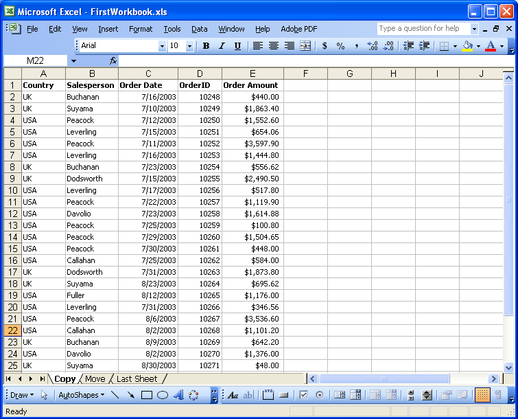
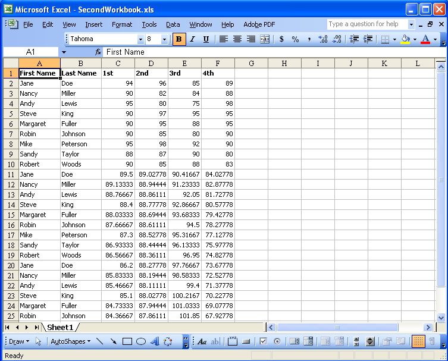
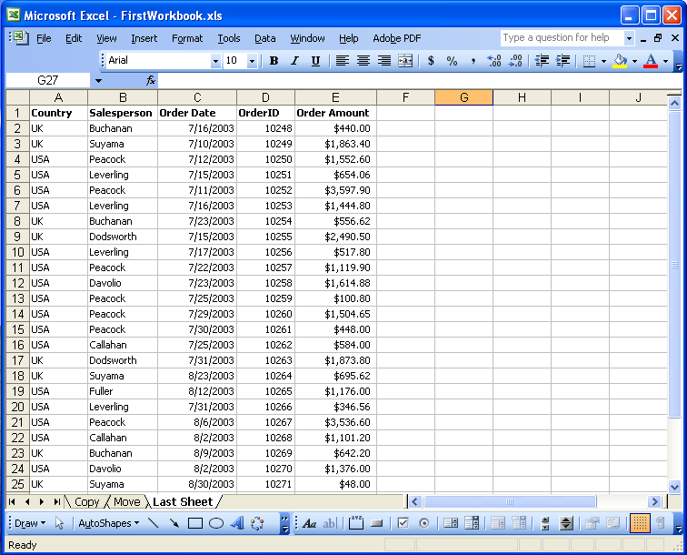
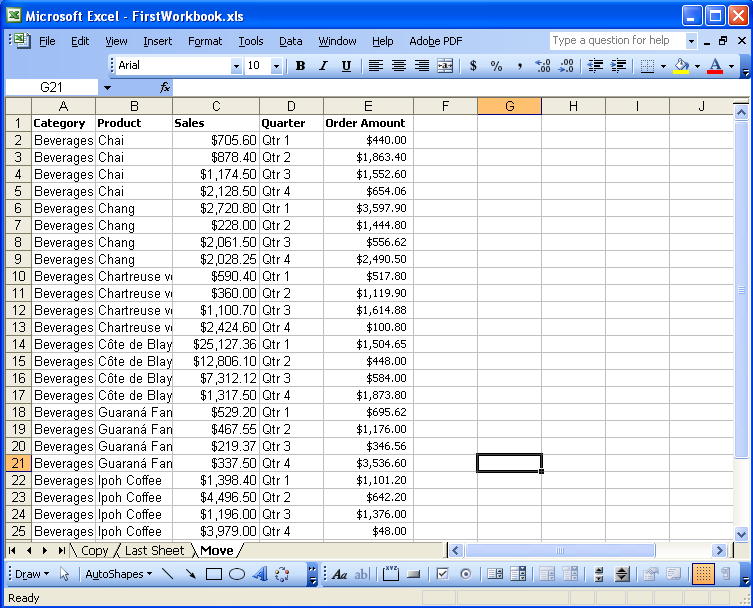
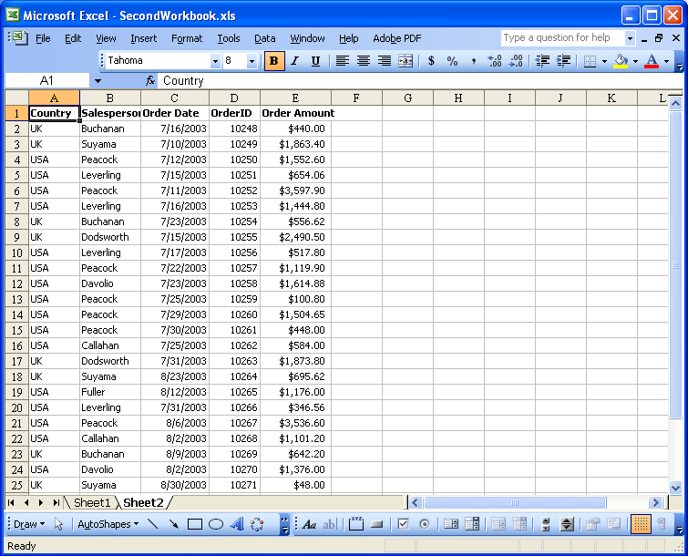
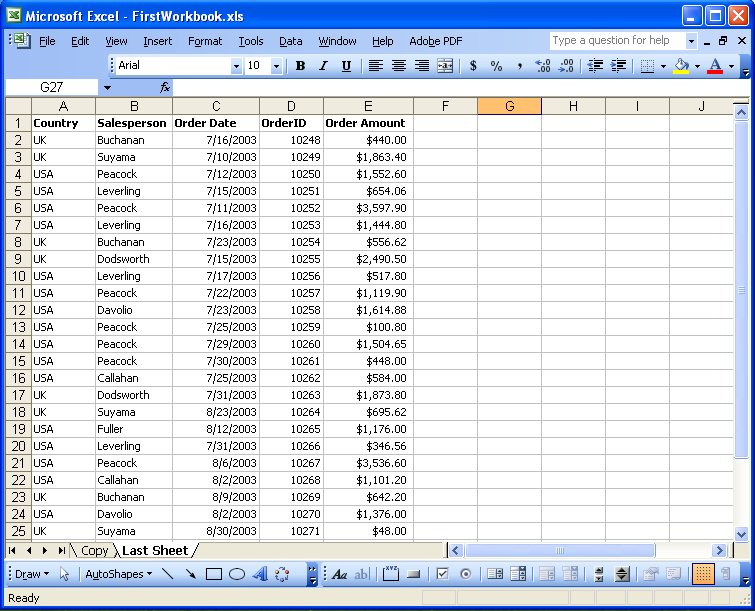
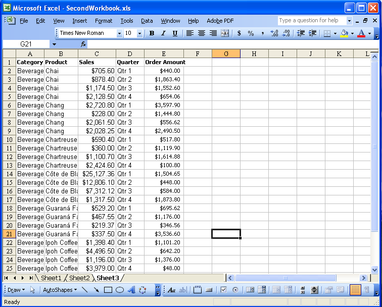

{} 

Sometimes, you do need a number of worksheets with common formatting and data entry. For example, if you work with quarterly budgets, you might want to create a workbook with sheets that contain the same column headings, row headings, and formulas. There is a way to do this: by creating one sheet and then copying it three times.

Aspose.Cells supports copying or moving worksheets within or between workbooks. Worksheets including data, formatting, tables, matrices, charts, images and other objects are copied with the highest degree of precision.

{} 
### **Copying and Moving Worksheets**
This article explains how to use Aspose.Cells to:

- [Copy a worksheet within a workbook](/cells/java/copy-and-move-worksheets-within-and-between-workbooks-html/).
- [Move a worksheet within a workbook](/cells/java/copy-and-move-worksheets-within-and-between-workbooks-html/).
- [Copy a worksheet between workbooks](/cells/java/copy-and-move-worksheets-within-and-between-workbooks-html/).
- [Move a worksheet between workbooks](/cells/java/copy-and-move-worksheets-within-and-between-workbooks-html/).
#### **Copying a Worksheet within a Workbook**
The initial steps are the same for all examples.

1. Create two workbooks with some data in Microsoft Excel.
   For the purposes of this example, we created two new workbooks in Microsoft Excel and input some data into the worksheets.
- FirstWorkbook.xls (3 worksheets).
- SecondWorkbook.xls (1 worksheet). 

  **FirstWorkbook.xls** 

**SecondWorkbook.xls** 

1. Download and install Aspose.Cells:
   1. [Download Aspose.Cells for Java](http://www.aspose.com/community/files/72/java-components/aspose.cells-for-java/default.aspx).
   1. Unzip it on your development computer.
      All [Aspose](http://www.aspose.com/) components, when installed, work in evaluation mode. The evaluation mode has no time limit and it only injects watermarks into produced documents.
1. Create a project:
   1. Create a project using a Java editor such as Eclipse or create a simple program using a text editor.
1. Add a class path:
   1. Extract the Aspose.Cells.jar and dom4j_1.6.1.jar from Aspose.Cells.zip.
   1. Set the classpath of project in Eclipse:
      1. Select your project in Eclipse and click menus **Project**, then **Properties**.
      1. Select **Java Build Path** in the left side of thedialog, then select the Libraries tab,
      1. Click **Add JARs** or **Add External JARs** to select Aspose.Cells.jar and dom4j_1.6.1.jar and add them into build paths.

{} 

Or you can set the classpath at runtime in a DOS prompt on Windows.
For example:





javac -classpath %classpath%;e:\Aspose.Cells.jar; ClassName .javajava -classpath %classpath%;e:\Aspose.Cells.jar; ClassName





{}

1. Copy worksheet within a workbook:
   Below is the code used by to accomplish the task. It copies the worksheet Copy within FirstWorkbook.xls.

Executing the codemoves the worksheet named Copy within FirstWorkbook.xls with the new name Last Sheet.

**Output file** 



#### **Moving a Worksheet with in a Workbook**
Below is the code used to accomplish the task.

Executing the code moves the worksheet Move from index 1 to index 2 in FirstWorkbook.xls.

**Output file** 



#### **Copying a Worksheet between Workbooks**
Executing the code copies the worksheet Copy to SecondWorkbook.xls with the new name Sheet2.

**Output file** 



#### **Moving a Worksheet between Workbooks**
Executing the code moves the move worksheet from FirstWorkbook.xls to SecondWorkbook.xls with the new name Sheet3.

**Output FirstWorkbook.xls** 

**Output SecondWorkbook.xls** 



### **Conclusion**
{} 

This article explains how to copy and move worksheets within and between workbooks using Aspose.Cells.

Aspose.Cells has benefited from years of research, design and careful tuning. We welcome your queries, comments and suggestions at [Aspose.Cells Forum](http://www.aspose.com/community/forums/aspose.cells-product-family/19/showforum.aspx). We warranty a prompt reply.

{}
