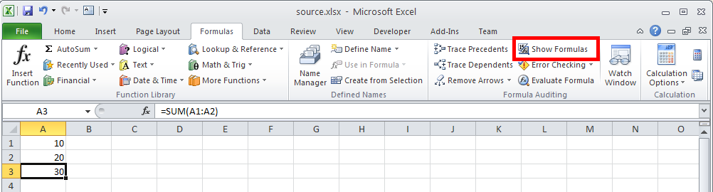
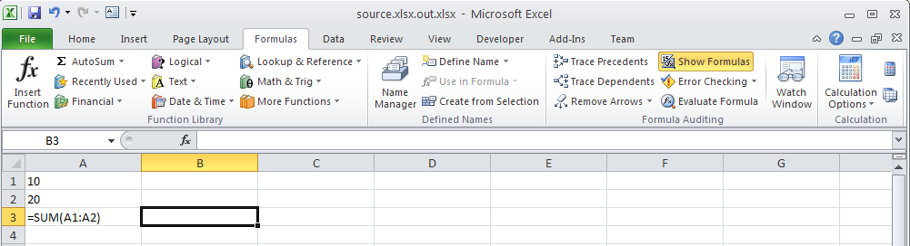

{}

It is possible to show formulas instead of calculated values in Microsoft Excel using t*Show Formulas* option from the **Formulas** ribbon. When formulas are shown, Microsoft Excel displays formulas in the worksheet. You can achieve the same thing using Aspose.Cells.

{} 

Aspose.Cells provides a [**Worksheet.setShowFormulas()**](https://reference.aspose.com/cells/java/com.aspose.cells/worksheet#ShowFormulas) property. Set this to **true** to set Microsoft Excel to display formulas.

The following image shows the worksheet which has a formula in cell A3: =Sum(A1:A2).

**Worksheet with formula in cell A3**

The following image shows the formula instead of the calculated value, enabled by setting the [**Worksheet.setShowFormulas()**](https://reference.aspose.com/cells/java/com.aspose.cells/worksheet#ShowFormulas) property to **true** with Aspose.Cells.

**Worksheet now shows formula instead of the calculated value**


