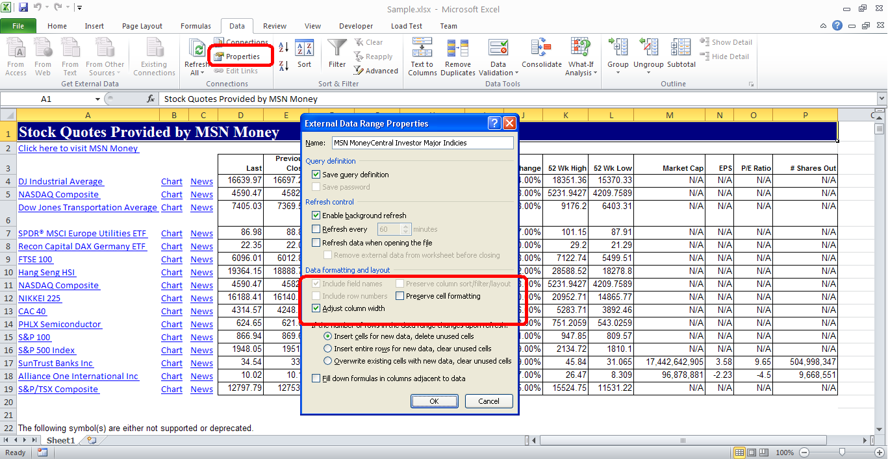
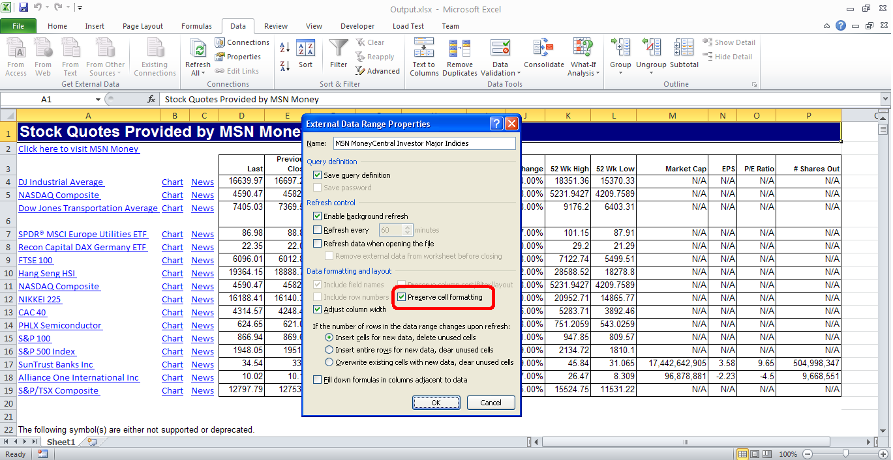

{} 

Aspose.Cells provides [Worksheet.getQueryTables()](https://apireference.aspose.com/cells/java/com.aspose.cells/worksheet#QueryTables) collection which returns the [QueryTableCollection](https://apireference.aspose.com/cells/java/com.aspose.cells/QueryTableCollection). To get a specific [QueryTable](https://apireference.aspose.com/cells/java/com.aspose.cells/QueryTable), use the [QueryTableCollection.get()](https://apireference.aspose.com/cells/java/com.aspose.cells/querytablecollection#Item%20\(int\)) property and pass the index of the QueryTable. The [QueryTable](https://apireference.aspose.com/cells/java/com.aspose.cells/QueryTable) class has the following two properties for adjusting the QueryTable.

- [QueryTable.getAdjustColumnWidth()](https://apireference.aspose.com/cells/java/com.aspose.cells/querytable#AdjustColumnWidth)
- [QueryTable.getPreserveFormatting()](https://apireference.aspose.com/cells/java/com.aspose.cells/querytable#PreserveFormatting)

These are both boolean values. You can view them in Microsoft Excel via Data > Connections > Properties.

{} 
## **Reading and Writing Query Table of Worksheet**
The following sample code reads the first [QueryTable](https://apireference.aspose.com/cells/java/com.aspose.cells/QueryTable) of the first worksheet and then prints both of the [QueryTable](https://apireference.aspose.com/cells/java/com.aspose.cells/QueryTable) properties. Then it sets the [QueryTable.PreserveFormatting](https://apireference.aspose.com/cells/java/com.aspose.cells/querytable#PreserveFormatting) to **true**.

The following screenshot shows the [source excel file](5472578.xlsx) used in the code and its properties showing both of the [QueryTable](https://apireference.aspose.com/cells/java/com.aspose.cells/QueryTable) values.

The following screenshot shows the [output excel file](5472574.xlsx) generated by the code and its properties showing both of the [QueryTable](https://apireference.aspose.com/cells/java/com.aspose.cells/QueryTable) values. As you can see the Preserved Formatting checkbox is checked now.


## **Console Output**
Here is the console output of the above sample code



 Adjust Column Width: true

Preserve Formatting: false


## **Retrieve query table result range**
Aspose.Cells provides the option to read the address i.e. result range of cells for a query table. Following code demonstrates this feature by reading the address of result range for a query table. The sample file can be downloaded [here](Query%20TXT.xlsx).


