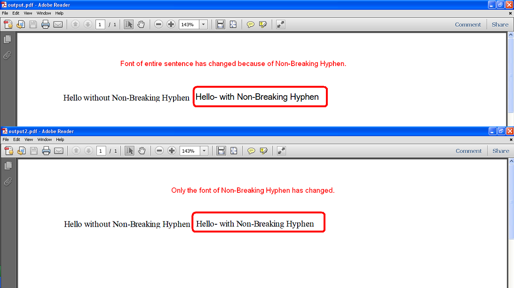

{}

Some Unicode characters are not displayable by the user-specified font. One such Unicode character is **Non-breaking Hyphen** (U+2011) and its Unicode number is 8209. This character cannot be displayed with **Times New Roman**, but it can be displayed with other fonts like **Arial Unicode MS**.

When such a character occurs inside some word or sentence which is in some specific font like Times New Roman, then Aspose.Cells changes the font of the entire word or sentence to font which could display this character like Arial Unicode to MS.

However, this is undesirable behavior for some users and they want only that the specific character's font must be changed instead of changing the font of the entire word or sentence.

To deal with this problem, Aspose.Cells provides [**PdfSaveOptions.setFontSubstitutionCharGranularity()**](https://reference.aspose.com/cells/java/com.aspose.cells/pdfsaveoptions#IsFontSubstitutionCharGranularity) property which should be set **true** so that only the font of the specific character which is not displayable is changed and the font for the rest of the word or sentence remains the same.

{}

## **Example**

The following screenshot compares the two output PDFs generated by the sample code below. One was generated without setting [**PdfSaveOptions.setFontSubstitutionCharGranularity()**](https://reference.aspose.com/cells/java/com.aspose.cells/pdfsaveoptions#IsFontSubstitutionCharGranularity) property and the other was generated after setting the [**PdfSaveOptions.setFontSubstitutionCharGranularity()**](https://reference.aspose.com/cells/java/com.aspose.cells/pdfsaveoptions#IsFontSubstitutionCharGranularity) property to **true**. As you can see in the first PDF, the font of the entire sentence has changed from Times New Roman to Arial Unicode MS because of Non-Breaking Hyphen. While in the second PDF, only the font of Non-Breaking Hyphen has changed.


