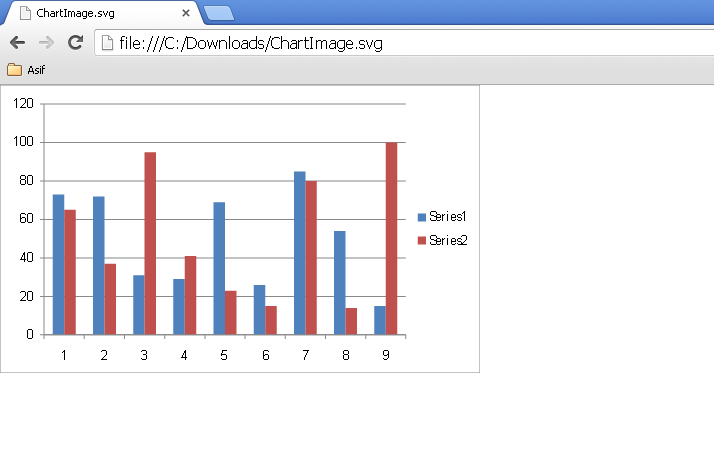
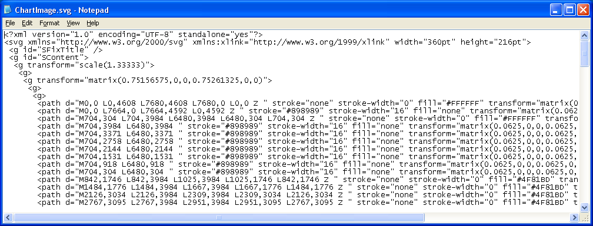

{} 

Scalable Vector Graphics (SVG) is an XML-based vector image format for two-dimensional graphics that also supports interactivity and animation. The SVG specification is an open standard developed by the World Wide Web Consortium (W3C) since 1999.

SVG images and their behaviors are defined in XML text files. This means that they can be searched, indexed, scripted, and compressed. As XML files, SVG images can be created and edited with any text editor, but are more often created with drawing software.

Aspose.Cells can save charts as images in various formats like BMP, JPEG, PNG, GIF, SVG, etc. This article explains how to save charts as SVG images.

{} 

The following sample code explains how to use Aspose.Cells to convert a chart into an SVG format image. The code loads the source Excel file and then saves the first chart found on the first worksheet to SVG.

The following screenshot shows the converted chart image in SVG format created with the sample code.

**Output image** 

Because SVG is an XML-based format, you can also open the output chart image in a text editor like Notepad as shown in this screenshot.

**Output SCG in a text editor** 


