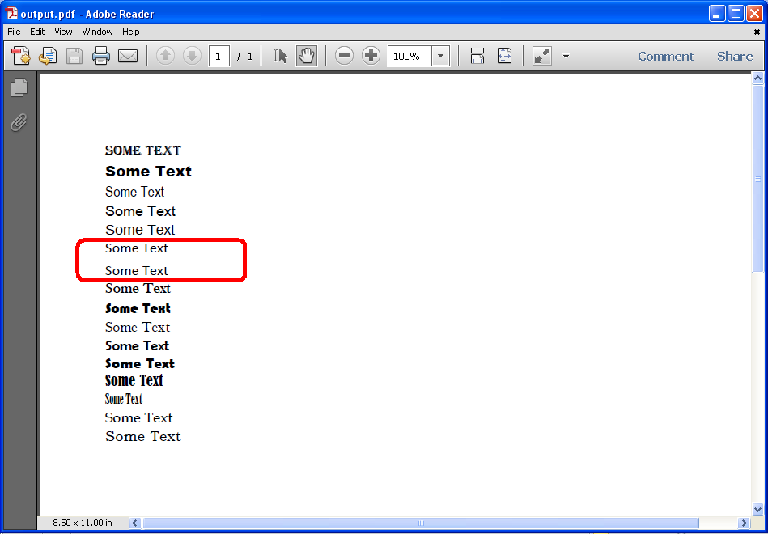

{}

Sometimes, when rendering Microsoft Excel files to PDF, Aspose.Cells substitutes fonts. Aspose.Cells provides a feature that lets developers know that a particular font has been substituted by firing a warning. This is a useful feature that can help you identify why Aspose.Cells rendered PDF is differently than the actual Excel file and you can then take appropriate actions. For example, you can install the missing fonts so that rendering results could look same.

If you want to get the warnings for font substitution while rendering an Excel file to PDF, implement the IWarningCallback interface and set the PdfSaveOptions.setWarningCallback() method with your implemented interface.

{}

The screenshot below shows the source Excel file used in the following code. It has some text in cells A6 and A7 in fonts that are not rendered well by Microsoft Excel.

Aspose.Cells will substitute the fonts in the cells A6 and A7 with suitable fonts as shown below.

#### **Download Source File and Output PDF**

You can download the source Excel file and the output PDF from the following links

- [source.xlsx](5472700.xlsx)
- [output.pdf](5472699.pdf)

The following code implements the [**IWarningCallback**](https://apireference.aspose.com/cells/java/com.aspose.cells/IWarningCallback) and set the [**PdfSaveOptions.setWarningCallback()**](https://apireference.aspose.com/cells/java/com.aspose.cells/pdfsaveoptions#WarningCallback) method with the implemented interface. Now, whenever any font will be substituted in any cell, Aspose.Cells will fire a warning inside the WarningCallback.warning() method.



 public class WarningCallback implements IWarningCallback {

    @Override

    public void warning(WarningInfo info) {

        if(info.getWarningType() == WarningType.FONT_SUBSTITUTION)

        {

            System.out.println("WARNING INFO: " + info.getDescription());

        }

    }

}

//........

//........

static void Run() throws Exception

{

    Workbook workbook = new Workbook("source.xlsx");

    PdfSaveOptions options = new PdfSaveOptions();

    options.setWarningCallback(new WarningCallback());

    workbook.save("output.pdf", options);

}



## **Warnings Output**

After converting the source file, the following warnings are output to the debug console:



WARNING INFO: Font substitution: Font [ Athene Logos; Regular ] has been substituted in Cell [ A6 ] in Sheet [ Sheet1 ].

WARNING INFO: Font substitution: Font [ B Traffic; Regular ] has been substituted in Cell [ A7 ] in Sheet [ Sheet1 ].



{}

If your spreadsheet contains formulas, it is best to call Workbook.calculateFormula method just before rendering the spreadsheet to PDF format. Doing so will ensure that the formula dependent values are recalculated, and the correct values are rendered in the PDF. 

{}
