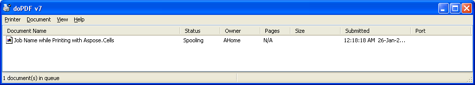

{} 

You can specify Job or Document Name while printing your workbook or worksheet using the [WorkbookRender](https://apireference.aspose.com/java/cells/com.aspose.cells/WorkbookRender) or [SheetRender](https://apireference.aspose.com/java/cells/com.aspose.cells/SheetRender) objects. Aspose.Cells provides the [WorkbookRender.toPrinter(printerName, jobName)](https://apireference.aspose.com/java/cells/com.aspose.cells/workbookrender#toPrinter\(java.lang.String,%20java.lang.String\)) and [SheetRender.toPrinter(printerName, jobName)](https://apireference.aspose.com/java/cells/com.aspose.cells/sheetrender#toPrinter\(java.lang.String,%20java.lang.String\)) methods which you can use to specify Job Name while printing your workbook or worksheet

{} 
#### **Specify Job or Document Name while printing with Aspose.Cells**
The sample code loads the source Excel file and then sends it to the printer by specifying the job or document name using the [WorkbookRender.toPrinter(printerName, jobName)](https://apireference.aspose.com/java/cells/com.aspose.cells/workbookrender#toPrinter\(java.lang.String,%20java.lang.String\))   and [SheetRender.toPrinter(printerName, jobName)](https://apireference.aspose.com/java/cells/com.aspose.cells/sheetrender#toPrinter\(java.lang.String,%20java.lang.String\))   methods. The screenshot shows how the job name looks like in the printer queue.


