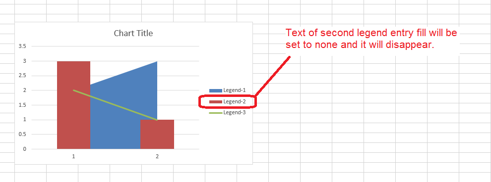

{} 

If you want to set the text of the chart's legend entry fill to none so that it should not display inside the chart legend then please set the [LegendEntry.IsTextNoFill](https://apireference.aspose.com/java/cells/com.aspose.cells/legendentry#IsTextNoFill) to **true**.

{} 
#### **Set text of chart legend entry fill to none using Aspose.Cells**
The following sample code sets the text of the chart's second legend entry fill to none. Please download the [sample excel file](attachments/5276030/5473437.xlsx) used in this code and the [output excel file](attachments/5276030/5473440.xlsx) generated by it for your reference.

The following screenshot highlights the effect of this code on [sample excel file](attachments/5276030/5473437.xlsx).


