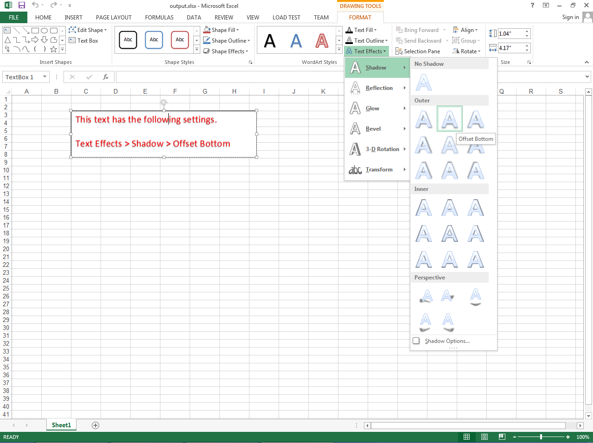

{} 

You can set the **Shadow** of **Text Effects** of any Shape or TextBox. Please use the [Shape.TextBody](https://apireference.aspose.com/java/cells/com.aspose.cells/shape#TextBody) property. It presents the setting of the shape's text and returns [FontSettingCollection](https://apireference.aspose.com/java/cells/com.aspose.cells/FontSettingCollection). After accessing [FontSetting](https://apireference.aspose.com/java/cells/com.aspose.cells/FontSetting) from it, please set the **Shadow** via [FontSetting.getTextOptions().getShadow().setPresetType()](https://apireference.aspose.com/java/cells/com.aspose.cells/shadoweffect#PresetType) property. This property is of type [PresetShadowType](https://apireference.aspose.com/java/cells/com.aspose.cells/PresetShadowType) which has several values. Some of these are

- [OFFSET_DIAGONAL_BOTTOM_RIGHT](https://apireference.aspose.com/java/cells/com.aspose.cells/presetshadowtype#OFFSET_DIAGONAL_BOTTOM_RIGHT)
- [OFFSET_BOTTOM](https://apireference.aspose.com/java/cells/com.aspose.cells/presetshadowtype#OFFSET_BOTTOM)
- [OFFSET_DIAGONAL_TOP_RIGHT](https://apireference.aspose.com/java/cells/com.aspose.cells/presetshadowtype#OFFSET_DIAGONAL_TOP_RIGHT)
- [INSIDE_LEFT](https://apireference.aspose.com/java/cells/com.aspose.cells/presetshadowtype#INSIDE_LEFT)
- [INSIDE_CENTER](https://apireference.aspose.com/java/cells/com.aspose.cells/presetshadowtype#INSIDE_CENTER)
- [PERSPECTIVE_DIAGONAL_UPPER_LEFT](https://apireference.aspose.com/java/cells/com.aspose.cells/presetshadowtype#PERSPECTIVE_DIAGONAL_UPPER_LEFT)
- [PERSPECTIVE_DIAGONAL_UPPER_RIGHT](https://apireference.aspose.com/java/cells/com.aspose.cells/presetshadowtype#PERSPECTIVE_DIAGONAL_UPPER_RIGHT)

{} 
#### **Setting Shadow of Text Effects of Shape or TextBox**
The following screenshot shows the [output excel file](5473446.xlsx) generated with the following sample code. The screenshot also shows the value of the **Shadow** which has been set as **Offset Bottom**.


