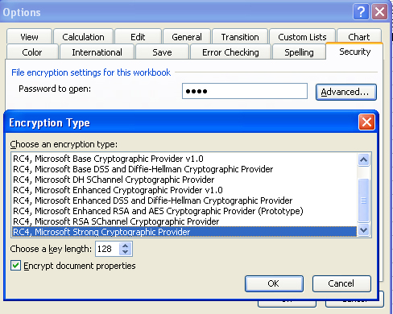

{}

Microsoft Excel (97-2007/2010) enables you to encrypt and password protect spreadsheets. It uses algorithms provided by a Crypto Service Provider. A Crypto Service Provider (or CSP) is a set of cryptographic algorithms with different properties. The default CSP is "Office 97/2000 Compatible". This is a CSP with some public known security issues. Spreadsheets that are secured with the "weak encryption (XOR)" or with the "Office 97/2000 Compatible" encryption type can be cracked easily.

To overcome this problem, use one of the strong encryption types provided by Microsoft Excel. You can change the encryption type to the strongest available CSP. For strong encryption, a minimum key length of 128 bits is required, for example 'Microsoft Strong Cryptographic Provider'.

You can also encrypt and password protect Excel files with strong encryption type using the Aspose.Cells API.

{}

## **Applying Encryption with Microsoft Excel**

To implement file encryption in Microsoft Excel (for example 2007):

1. From the **Tools** menu, select **Options**.
1. Select the **Security** tab.
1. Enter a value for the **Password to open** field.
1. Click **Advanced**.
1. Choose the encryption type and confirm the password.

   **Setting encryption in Microsoft Excel**

## **Applying Encryption with Aspose.Cells**

The code example below applies strong encryption on a file and sets a password.


