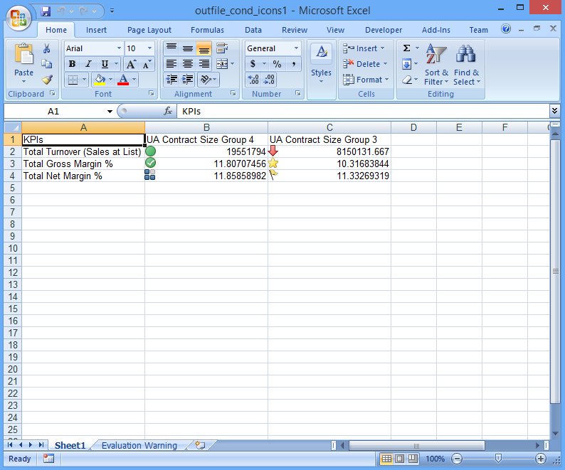

{} 

Sometimes, you want to add conditional icons next to the text in a cell to make data more meaningful to readers. You want to use some of the conditional formatting icon types but without applying conditional formatting to cells. Aspose.Cells supports the feature.

{} 

Following is a sample that creates an XLSX file from scratch, adding conditional icons to cells with text without applying conditional formatting.

When the code is executed, images from the conditional icon set are added in the cell area "B2:C4" as shown below.

**Output file** 


