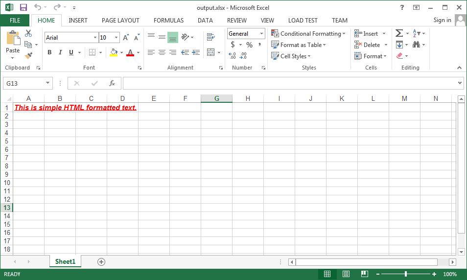

{}

Aspose.Cells supports converting Microsoft Excel oriented HTML into XLS/XLSX format. It means, the HTML generated by Microsoft Excel can be converted back to XLS/XLSX format using Aspose.Cells.

Similarly, if there is some simple HTML, Aspose.Cells can convert it into HTML Rich Text. Aspose.Cells provides [**Cell.setHtmlString()**](https://apireference.aspose.com/cells/java/com.aspose.cells/cell#HtmlString) property which can take such a simple HTML and convert it to formatted cell text.

{}

## **Example**

The following screenshot shows the output Excel file generated with Aspose.Cells. As you can see, it shows HTML formatted rich text added inside the cell A1 using the [**Cell.setHtmlString()**](https://apireference.aspose.com/cells/java/com.aspose.cells/cell#HtmlString) property.

This is the sample code that generated the output Excel file as shown inside the above screenshot.



## Related Articles

- [Display Bullets by setting Cell Value using HTML](/cells/java/display-bullets-by-setting-cell-value-using/)
