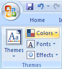
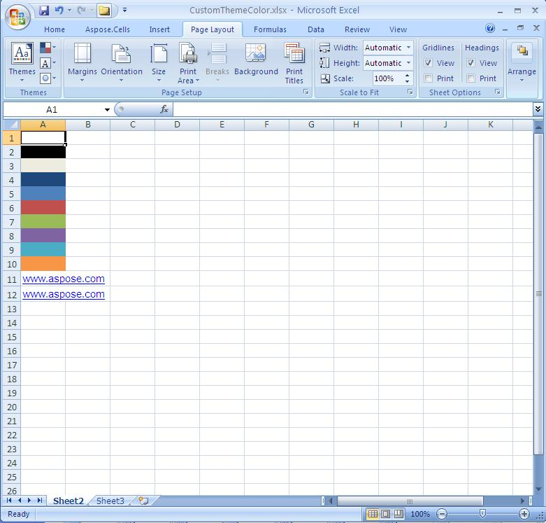
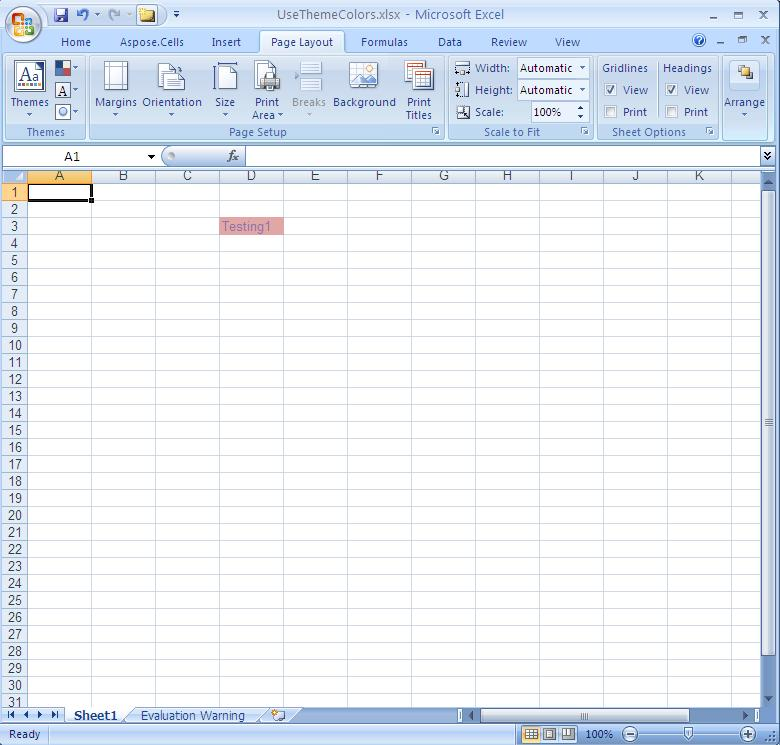

{}

Themes provide a unified look with named styles, graphical effects and other objects used in a workbook. For example, the Accent1 style looks different in the Office and the Apex themes. Often, you apply a document theme and then amend it as per your needs.

**Applying themes in Microsoft Excel**

{}

## **Get and Set Theme Colors**

Aspose.Cells APIs provide features for customizing themes and colors. Below are a few methods and properties that implements theme colors.

- Style.ForegroundThemeColor property can be used to set the foreground color.
- Style.BackgroundThemeColor property can be used to set the background color.
- Font.ThemeColor property can be used to set the font color.
- Workbook.getThemeColor method can be used to get a theme color.
- Workbook.setThemeColor method can be used to set a theme color.

The following example shows how to get and set theme colors.

The following example uses a template XLSX file, gets the colors for different theme color types, changes the colors and saves the Microsoft Excel file.



### **Customizing Themes**

The following example shows how to apply custom themes with your desired colors. The example uses a sample template file manually created in Microsoft Excel 2007.

**The template CustomThemeColor.xlsx file**

The following example loads a template XLSX file, defines colors for different theme color types, applies the custom colors and saves the excel file.

**The generated file with customized theme colors**



### **Using Theme Colors**

The following example applies a cell’s foreground and font colors based on the default theme (of the workbook) color types. It also saves the excel file to disk.

The following output is generated when executing the code.

**The theme colors applied to the D3 cell of the worksheet** 


