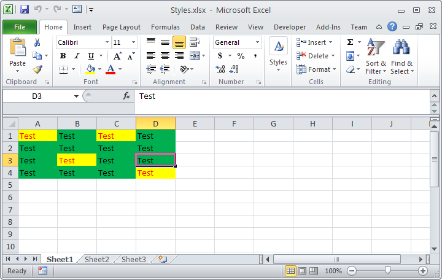

{} 

Sometimes, you need to find the cells with some particular style. You can use Aspose.Cells to find all such cells which have a common style. Aspose.Cells provides [FindOptions.setStyle()](https://apireference.aspose.com/java/cells/com.aspose.cells/findoptions#Style) property which you can use to specify the style for searching cells.

{} 
#### **Example**
In this article, we will find all the cells which have the same style as that of cell A1. Please see the screenshot of the source file used in the following code.

After the execution of code, all the cells that have the same style as of cell A1 will have a text "Found".

**Figure:** Source file with cells having styles

Here is the output file generated by the following code. You can see all the cells that have the same style as of cell A1 has a text "Found"

**Figure:** Output file with found cells after searching by A1 style
#### **Sample Code**

