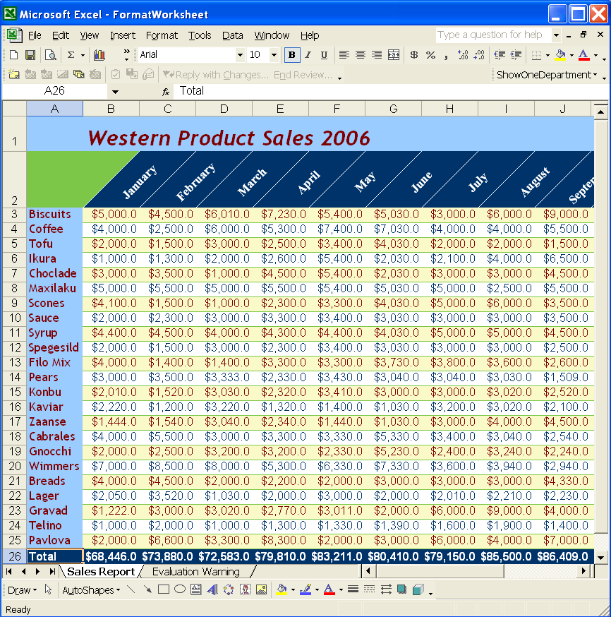

{}

This article shows how to:

1. Use styles to quickly format data.
1. Format cells in rows and columns.
1. Use borders and colors to emphasize data.
1. Apply number formats to emphasize data.
1. Use fonts and attributes to highlight data.
1. Format data in a named range.
1. Change data alignment and orientation.
1. Set row height and column width.

The example project performs all of these tasks and provides developers with a detailed description of how to create a workbook, add data into and apply formatting using Aspose.Cells for Java.

{}

## **Data Formatting**

Formatting is used to distinguish between different types of information and to display data clearly.

A format represents a style and is defined as a set of characteristics, such as fonts and font sizes, number formats, cell borders, cell shading, indentation, alignment and text orientation. Borders provide further ways to highlight information. A border is a line drawn around a cell or a group of cells.

Number formats also make data more meaningful. By applying different number formats, you can change the appearance of numbers without changing the number behind the appearance.

Aspose.Cells lets you to draw cell & range borders quickly & easily. It also lets you apply fonts and shade cells. The component is efficient enough that you can format a complete row or column, set alignments, wrap and rotate text in cells. Aspose.Cells further supports all number formats supported by Microsoft Excel.

This article shows how to generate an annual sales report. The workbook is created from scratch, then data is inserted and the worksheet is formatted. We show how to create a simple console application which creates an Excel workbook (you can also use a template file), insert sales data into the first worksheet, format the data and save an Excel file.

### **Process**



### **Result**

After executing the above code, a Microsoft Excel file is generated with a new, formatted worksheet called Sales Report.

**The output file**

## **Summary**

{}

Worksheet data formatting is important because how data looks can change its meaning. If you plan to print worksheets, email them to clients, or show it to management, think about whether the formatting is viewer-friendly.
Careful use of color, shading, borders, fonts, number formatting, alignment, indentation and orientation can make the difference between a messy glob of data and a worksheet that's easy to work with and understand.

This articles demonstrated how to format data occupied in different cells in a worksheet with Aspose.Cells. Hopefully, you can use the example in your own scenarios.

Aspose.Cells offers more flexibility than other solutions and provides outstanding speed, efficiency and reliability. Aspose.Cells benefits from years of research, design and careful tuning.

We welcome your queries, comments and suggestions at [Aspose.Cells Forum](https://forum.aspose.com/c/cells/). We warranty a prompt reply.

{}
