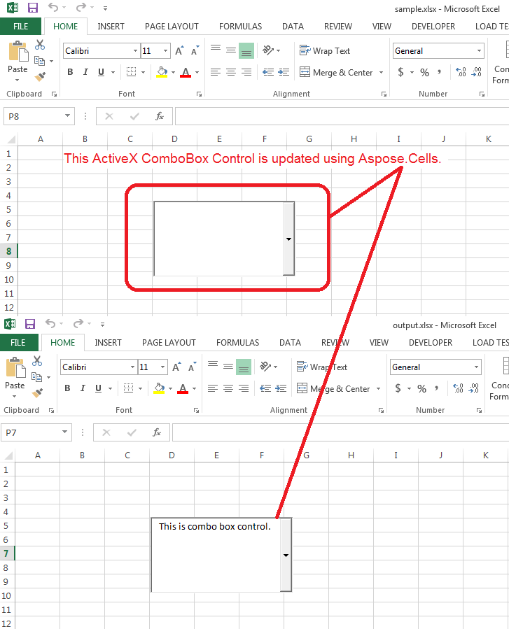

## **Possible Usage Scenarios**
You can read or write the values of ActiveX ComboBox Control using Aspose.Cells. Please access the ActiveX Control via [Shape.ActiveXControl](https://apireference.aspose.com/java/cells/com.aspose.cells/shape#ActiveXControl) property and check its type via [ActiveXControl.Type](https://apireference.aspose.com/java/cells/com.aspose.cells/activexcontrol#Type) property, it should return [ControlType.ComboBox](https://apireference.aspose.com/java/cells/com.aspose.cells/controltype#COMBO_BOX) value and then typecast it into [ComboBoxActiveXControl](https://apireference.aspose.com/java/cells/com.aspose.cells/ComboBoxActiveXControl) object and read or modify its various properties.

Please download the [sample excel file](5473374.xlsx) used in the following sample code and the [output excel file](5473375.xlsx) generated by it.
## **Update ActiveX ComboBox Control**
The following screenshot shows the effect of the sample code on the [sample excel file](5473374.xlsx). As you can see, the ActiveX ComboBox value has been updated to "This is combo box control".

## **Sample Code**
The following sample code updates the value of ActiveX ComboBox Control present inside the [sample excel file](5473374.xlsx).


