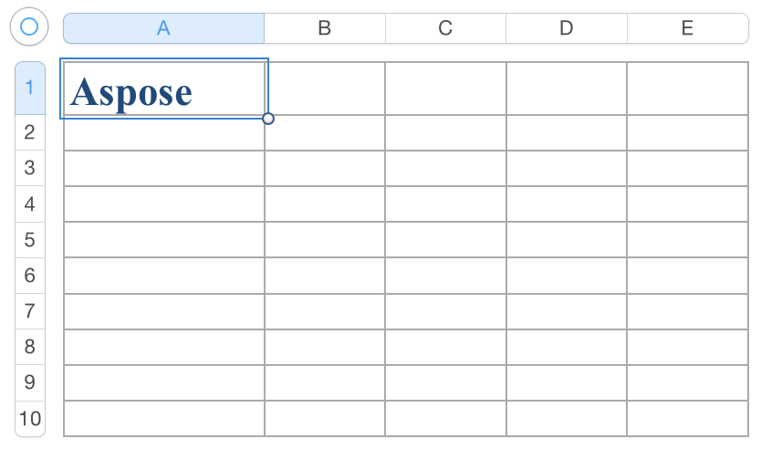

{} 

Aspose.Cells provides a vast collection of re-usable styles to format a cell in a spreadsheet document. We can use built-in styles in our workbook and also create custom styles.

{} 
### **How to use Built-in Styles**
The method [Workbook.createBuiltinStyle](https://apireference.aspose.com/java/cells/com.aspose.cells/workbook#createBuiltinStyle\(int\)) and class [BuiltinStyleType](https://apireference.aspose.com/java/cells/com.aspose.cells/BuiltinStyleType) make it convenient to create re-usable styles. Here is a list of all possible built-in styles:

- [TWENTY_PERCENT_ACCENT_1](https://apireference.aspose.com/java/cells/com.aspose.cells/builtinstyletype#TWENTY_PERCENT_ACCENT_1)
- [TWENTY_PERCENT_ACCENT_2](https://apireference.aspose.com/java/cells/com.aspose.cells/builtinstyletype#TWENTY_PERCENT_ACCENT_2)
- [TWENTY_PERCENT_ACCENT_3](https://apireference.aspose.com/java/cells/com.aspose.cells/builtinstyletype#TWENTY_PERCENT_ACCENT_3)
- [TWENTY_PERCENT_ACCENT_4](https://apireference.aspose.com/java/cells/com.aspose.cells/builtinstyletype#TWENTY_PERCENT_ACCENT_4)
- [TWENTY_PERCENT_ACCENT_5](https://apireference.aspose.com/java/cells/com.aspose.cells/builtinstyletype#TWENTY_PERCENT_ACCENT_5)
- [TWENTY_PERCENT_ACCENT_6](https://apireference.aspose.com/java/cells/com.aspose.cells/builtinstyletype#TWENTY_PERCENT_ACCENT_6)
- [FORTY_PERCENT_ACCENT_1](https://apireference.aspose.com/java/cells/com.aspose.cells/builtinstyletype#FORTY_PERCENT_ACCENT_1)
- [FORTY_PERCENT_ACCENT_2](https://apireference.aspose.com/java/cells/com.aspose.cells/builtinstyletype#FORTY_PERCENT_ACCENT_2)
- [FORTY_PERCENT_ACCENT_3](https://apireference.aspose.com/java/cells/com.aspose.cells/builtinstyletype#FORTY_PERCENT_ACCENT_3)
- [FORTY_PERCENT_ACCENT_4](https://apireference.aspose.com/java/cells/com.aspose.cells/builtinstyletype#FORTY_PERCENT_ACCENT_4)
- [FORTY_PERCENT_ACCENT_5](https://apireference.aspose.com/java/cells/com.aspose.cells/builtinstyletype#FORTY_PERCENT_ACCENT_5)
- [FORTY_PERCENT_ACCENT_6](https://apireference.aspose.com/java/cells/com.aspose.cells/builtinstyletype#FORTY_PERCENT_ACCENT_6)
- [SIXTY_PERCENT_ACCENT_1](https://apireference.aspose.com/java/cells/com.aspose.cells/builtinstyletype#SIXTY_PERCENT_ACCENT_1)
- [SIXTY_PERCENT_ACCENT_2](https://apireference.aspose.com/java/cells/com.aspose.cells/builtinstyletype#SIXTY_PERCENT_ACCENT_2)
- [SIXTY_PERCENT_ACCENT_3](https://apireference.aspose.com/java/cells/com.aspose.cells/builtinstyletype#SIXTY_PERCENT_ACCENT_3)
- [SIXTY_PERCENT_ACCENT_4](https://apireference.aspose.com/java/cells/com.aspose.cells/builtinstyletype#SIXTY_PERCENT_ACCENT_4)
- [SIXTY_PERCENT_ACCENT_5](https://apireference.aspose.com/java/cells/com.aspose.cells/builtinstyletype#SIXTY_PERCENT_ACCENT_5)
- [SIXTY_PERCENT_ACCENT_6](https://apireference.aspose.com/java/cells/com.aspose.cells/builtinstyletype#SIXTY_PERCENT_ACCENT_6)
- [ACCENT_1](https://apireference.aspose.com/java/cells/com.aspose.cells/builtinstyletype#ACCENT_1)
- [ACCENT_2](https://apireference.aspose.com/java/cells/com.aspose.cells/builtinstyletype#ACCENT_2)
- [ACCENT_3](https://apireference.aspose.com/java/cells/com.aspose.cells/builtinstyletype#ACCENT_3)
- [ACCENT_4](https://apireference.aspose.com/java/cells/com.aspose.cells/builtinstyletype#ACCENT_4)
- [ACCENT_5](https://apireference.aspose.com/java/cells/com.aspose.cells/builtinstyletype#ACCENT_5)
- [ACCENT_6](https://apireference.aspose.com/java/cells/com.aspose.cells/builtinstyletype#ACCENT_6)
- [BAD](https://apireference.aspose.com/java/cells/com.aspose.cells/builtinstyletype#BAD)
- [CALCULATION](https://apireference.aspose.com/java/cells/com.aspose.cells/builtinstyletype#CALCULATION)
- [CHECK_CELL](https://apireference.aspose.com/java/cells/com.aspose.cells/builtinstyletype#CHECK_CELL)
- [COMMA](https://apireference.aspose.com/java/cells/com.aspose.cells/builtinstyletype#COMMA)
- [COMMA_1](https://apireference.aspose.com/java/cells/com.aspose.cells/builtinstyletype#COMMA_1)
- [CURRENCY](https://apireference.aspose.com/java/cells/com.aspose.cells/builtinstyletype#CURRENCY)
- [CURRENCY_1](https://apireference.aspose.com/java/cells/com.aspose.cells/builtinstyletype#CURRENCY_1)
- [EXPLANATORY_TEXT](https://apireference.aspose.com/java/cells/com.aspose.cells/builtinstyletype#EXPLANATORY_TEXT)
- [GOOD](https://apireference.aspose.com/java/cells/com.aspose.cells/builtinstyletype#GOOD)
- [HEADER_1](https://apireference.aspose.com/java/cells/com.aspose.cells/builtinstyletype#HEADER_1)
- [HEADER_2](https://apireference.aspose.com/java/cells/com.aspose.cells/builtinstyletype#HEADER_2)
- [HEADER_3](https://apireference.aspose.com/java/cells/com.aspose.cells/builtinstyletype#HEADER_3)
- [HEADER_4](https://apireference.aspose.com/java/cells/com.aspose.cells/builtinstyletype#HEADER_4)
- [HYPERLINK](https://apireference.aspose.com/java/cells/com.aspose.cells/builtinstyletype#HYPERLINK)
- [FOLLOWED_HYPERLINK](https://apireference.aspose.com/java/cells/com.aspose.cells/builtinstyletype#FOLLOWED_HYPERLINK)
- [INPUT](https://apireference.aspose.com/java/cells/com.aspose.cells/builtinstyletype#INPUT)
- [LINKED_CELL](https://apireference.aspose.com/java/cells/com.aspose.cells/builtinstyletype#LINKED_CELL)
- [NEUTRAL](https://apireference.aspose.com/java/cells/com.aspose.cells/builtinstyletype#NEUTRAL)
- [NORMAL](https://apireference.aspose.com/java/cells/com.aspose.cells/builtinstyletype#NORMAL)
- [NOTE](https://apireference.aspose.com/java/cells/com.aspose.cells/builtinstyletype#NOTE)
- [OUTPUT](https://apireference.aspose.com/java/cells/com.aspose.cells/builtinstyletype#OUTPUT)
- [PERCENT](https://apireference.aspose.com/java/cells/com.aspose.cells/builtinstyletype#PERCENT)
- [TITLE](https://apireference.aspose.com/java/cells/com.aspose.cells/builtinstyletype#TITLE)
- [TOTAL](https://apireference.aspose.com/java/cells/com.aspose.cells/builtinstyletype#TOTAL)
- [WARNING_TEXT](https://apireference.aspose.com/java/cells/com.aspose.cells/builtinstyletype#WARNING_TEXT)
- [ROW_LEVEL](https://apireference.aspose.com/java/cells/com.aspose.cells/builtinstyletype#ROW_LEVEL)
- [COLUMN_LEVEL](https://apireference.aspose.com/java/cells/com.aspose.cells/builtinstyletype#COLUMN_LEVEL)

The following code demonstrates how to use built-in styles.


