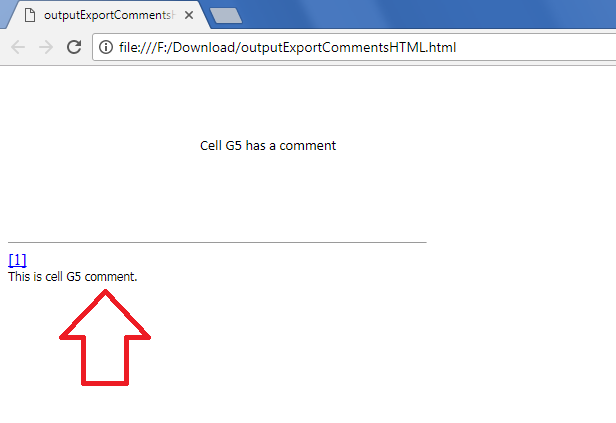

## **Possible Usage Scenarios**

When you save your Excel file into HTML, comments are not exported. However, Aspose.Cells provides this feature using the [**HtmlSaveOptions.IsExportComments**](https://reference.aspose.com/cells/java/com.aspose.cells/htmlsaveoptions#IsExportComments) property. If you set it **true**, then HTML will also display comments present in your Excel file.

## **Export Comments while Saving Excel file to Html**

The following sample code explains the usage of [**HtmlSaveOptions.IsExportComments**](https://reference.aspose.com/cells/java/com.aspose.cells/htmlsaveoptions#IsExportComments) property. The screenshot shows the effect of the code on the HTML when the property is set to **true**. Please download the [sample Excel file](50528270.xlsx) and the [generated HTML](50528269) for a reference.

## **Sample Code**


