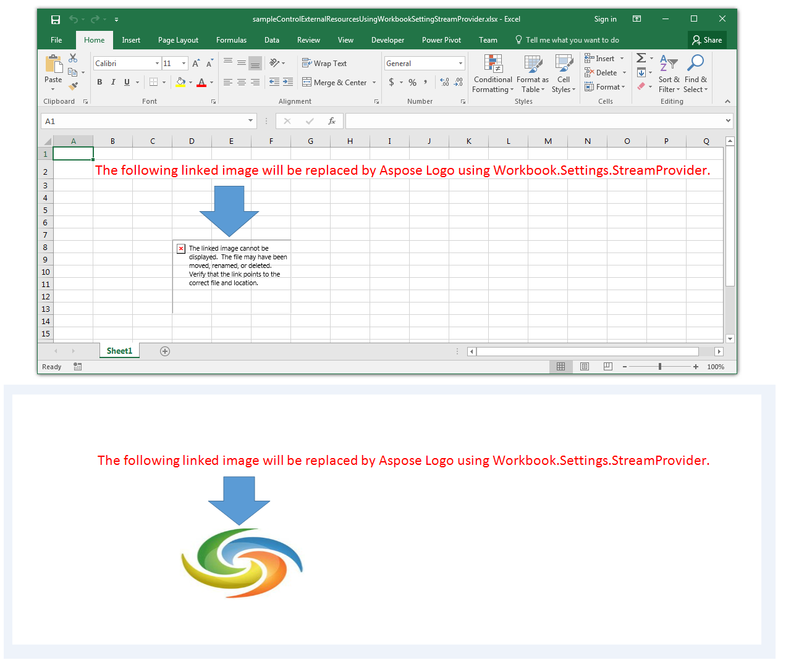

## **Possible Usage Scenarios**
Sometimes, your Excel file contains external resources e.g. linked images, etc. Aspose.Cells allows you to control these external resources using [Workbook.Settings.StreamProvider](https://apireference.aspose.com/cells/java/com.aspose.cells/workbooksettings#StreamProvider) which takes the implementation of [IStreamProvider](https://apireference.aspose.com/cells/java/com.aspose.cells/IStreamProvider) interface. Whenever you will try to render your worksheet containing external resources e.g. linked images, the methods of [IStreamProvider](https://apireference.aspose.com/cells/java/com.aspose.cells/IStreamProvider) interface will be invoked which will enable you to take appropriate actions for your external resources.
## **Control External Resources using WorkbookSetting.StreamProvider**
The following sample code explains the usage of [Workbook.Settings.StreamProvider](https://apireference.aspose.com/cells/java/com.aspose.cells/workbooksettings#StreamProvider). It loads the [sample Excel file](61767877.xlsx) containing a linked image. The code replaces the linked image with [Aspose Logo](61767874.png) and renders the entire sheet into a single image using [SheetRender](https://apireference.aspose.com/cells/java/com.aspose.cells/SheetRender) class. The following screenshot shows the sample Excel file and its [rendered output image](61767874.png) for a reference. As you can see, the broken linked image is replaced with Aspose Logo.

## **Sample Code**

