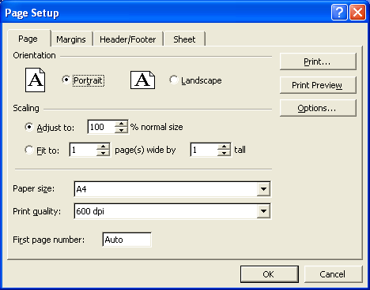
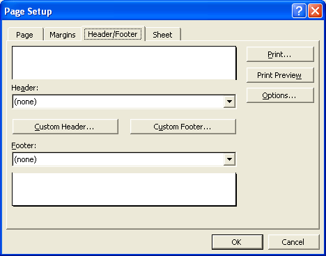
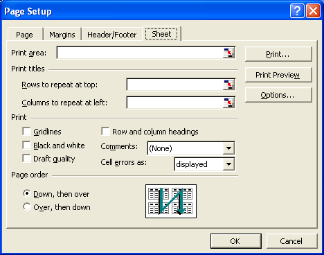

Sometimes, it is necessary to configure page setup settings for worksheets to control printing. These page setup settings offer various options.

**Page Options** 

Page setup options are fully supported in Aspose.Cells. This article explains how to set page options with Aspose.Cells.

## **Setting Page Options**

Aspose.Cells provides a class, [**Workbook**](https://reference.aspose.com/cells/java/com.aspose.cells/workbook), that represents a Microsoft Excel file. The Workbook class contains a Worksheets collection that allows access to each worksheet in the Excel file. A worksheet is represented by the [**Worksheet**](https://reference.aspose.com/cells/java/com.aspose.cells/worksheet) class.

The Worksheet class provides the PageSetup property, used to set page setup options. In fact, the PageSetup property is an object of the PageSetup class which makes it possible to set page layout options for a printed worksheet. The PageSetup class provides various properties are used to set page setup options. Some of these properties are discussed below.

### **Page Orientation**

Page orientation can be set to portrait or landscape using the [**PageSetup**](https://reference.aspose.com/cells/java/com.aspose.cells/pagesetup) class' [**setOrientation(PageOrientationType)**](https://reference.aspose.com/cells/java/com.aspose.cells/pagesetup#Orientation) method. The [**setOrientation(PageOrientationType)**](https://reference.aspose.com/cells/java/com.aspose.cells/pagesetup#Orientation) method takes the [**PageOrientationType**](https://reference.aspose.com/cells/java/com.aspose.cells/PageOrientationType) enumeration as a parameter. The members of the [**PageOrientationType**](https://reference.aspose.com/cells/java/com.aspose.cells/PageOrientationType) enumeration are listed below.

|**Page Orientation Types**|**Description**|
| :- | :- |
|[**LANDSCAPE**](https://reference.aspose.com/cells/java/com.aspose.cells/pageorientationtype#LANDSCAPE)|Landscape orientation|
|[**PORTRAIT**](https://reference.aspose.com/cells/java/com.aspose.cells/pageorientationtype#PORTRAIT)|Portrait orientation|



### **Scaling Factor**

It is possible to reduce or enlarge a worksheet's size by adjusting the scaling factor with the [**setZoom**](https://reference.aspose.com/cells/java/com.aspose.cells/pagesetup#Zoom) method of the [**PageSetup**](https://reference.aspose.com/cells/java/com.aspose.cells/pagesetup) class.



### **FitToPages Options**

To fit the contents of the worksheet to a specific number of pages, use the [**PageSetup**](https://reference.aspose.com/cells/java/com.aspose.cells/pagesetup) class' [**setFitToPagesTall**](https://reference.aspose.com/cells/java/com.aspose.cells/pagesetup#FitToPagesTall) and [**setFitToPagesWide**](https://reference.aspose.com/cells/java/com.aspose.cells/pagesetup#FitToPagesWide) methods. These methods are also used to scale worksheets.



### **Paper Size**

Set the paper size that the worksheets will be printed to using the [**PageSetup**](https://reference.aspose.com/cells/java/com.aspose.cells/pagesetup) class' [**PaperSize**](https://reference.aspose.com/cells/java/com.aspose.cells/pagesetup#PaperSize) property. The PaperSize property accepts one of the pre-defined values in the [**PaperSizeType**](https://reference.aspose.com/cells/java/com.aspose.cells/PaperSizeType) enumeration, listed below.

|**Paper Size Types**|**Description**|
| :- | :- |
|Paper10x14|10 in. x 14 in.|
|Paper11x17|11 in. x 17 in.|
|PaperA3|A3 (297 mm x 420 mm)|
|PaperA4|A4 (210 mm x 297 mm)|
|PaperA4Small|A4 Small (210 mm x 297 mm)|
|PaperA5|A5 (148 mm x 210 mm)|
|PaperB3|B3 (13.9 x 19.7 inches)|
|PaperB4|B4 (250 mm x 354 mm)|
|PaperB5|B5 (182 mm x 257 mm)|
|PaperBusinessCard|Business Card (90 mm x 55 mm)|
|PaperCSheet|C size sheet|
|PaperDSheet|D size sheet|
|PaperEnvelope10|Envelope #10 (4-1/8 in. x 9-1/2 in.)|
|PaperEnvelope11|Envelope #11 (4-1/2 in. x 10-3/8 in.)|
|PaperEnvelope12|Envelope #12 (4-1/2 in. x 11 in.)|
|PaperEnvelope14|Envelope #14 (5 in. x 11-1/2 in.)|
|PaperEnvelope9|Envelope #9 (3-7/8 in. x 8-7/8 in.)|
|PaperEnvelopeB4|Envelope B4 (250 mm x 353 mm)|
|PaperEnvelopeB5|Envelope B5 (176 mm x 250 mm)|
|PaperEnvelopeB6|Envelope B6 (176 mm x 125 mm)|
|PaperEnvelopeC3|Envelope C3 (324 mm x 458 mm)|
|PaperEnvelopeC4|Envelope C4 (229 mm x 324 mm)|
|PaperEnvelopeC5|Envelope C5 (162 mm x 229 mm)|
|PaperEnvelopeC6|Envelope C6 (114 mm x 162 mm)|
|PaperEnvelopeC65|Envelope C65 (114 mm x 229 mm)|
|PaperEnvelopeDL|Envelope DL (110 mm x 220 mm)|
|PaperEnvelopeItaly|Envelope Italy (110 mm x 230 mm)|
|PaperEnvelopeMonarch|Envelope Monarch (3-7/8 in. x 7-1/2 in.)|
|PaperEnvelopePersonal|Envelope (3-5/8 in. x 6-1/2 in.)|
|PaperESheet|E size sheet|
|PaperExecutive|Executive (7-1/2 in. x 10-1/2 in.)|
|PaperFanfoldLegalGerman|German Legal Fanfold (8-1/2 in. x 13 in.)|
|PaperFanfoldStdGerman|German Standard Fanfold (8-1/2 in. x 12 in.)|
|PaperFanfoldUS|U.S. Standard Fanfold (14-7/8 in. x 11 in.)|
|PaperFolio|Folio (8-1/2 in. x 13 in.)|
|PaperLedger|Ledger (17 in. x 11 in.)|
|PaperLegal|Legal (8-1/2 in. x 14 in.)|
|PaperLetter|Letter (8-1/2 in. x 11 in.)|
|PaperLetterSmall|Letter Small (8-1/2 in. x 11 in.)|
|PaperNote|Note (8-1/2 in. x 11 in.)|
|PaperQuarto|Quarto (215 mm x 275 mm)|
|PaperStatement|Statement (5-1/2 in. x 8-1/2 in.)|
|PaperTabloid|Tabloid (11 in. x 17 in.)|



### **Print Quality**

Set the print quality of the worksheets to be printed with the [**PageSetup**](https://reference.aspose.com/cells/java/com.aspose.cells/pagesetup) class' [**setPrintQuality**](https://reference.aspose.com/cells/java/com.aspose.cells/pagesetup#PrintQuality) method. The measuring unit for print quality is dots per inch (DPI).



### **First Page Number**

Start the numbering of worksheet pages using the [**PageSetup**](https://reference.aspose.com/cells/java/com.aspose.cells/pagesetup) class' [**setFirstPageNumber**](https://reference.aspose.com/cells/java/com.aspose.cells/pagesetup#FirstPageNumber) method. The setFirstPageNumber method sets the page number of the first worksheet page and the following pages are numbered in ascending order.



## **Setting Margins**

Aspose.Cells fully supports Microsoft Excel's page setup options. Developers may need to configure page setup settings for worksheets to control the printing process. This topic discusses how to use Aspose.Cells to configure page margins.

**Page margins in Microsoft Excel**

Aspose.Cells provides a class, [**Workbook**](https://reference.aspose.com/cells/java/com.aspose.cells/workbook) that represents a Microsoft Excel file. The Workbook class contains the Worksheets collection that allows access to each worksheet in a Excel file. A worksheet is represented by the [**Worksheet**](https://reference.aspose.com/cells/java/com.aspose.cells/worksheet) class.

The Worksheet class provides the PageSetup property, used to set page setup options. The PageSetup attribute is an object of the [**PageSetup**](https://reference.aspose.com/cells/java/com.aspose.cells/pagesetup) class which makes it possible to set different page layout options for a printed worksheet. The PageSetup class provides various properties and methods used to set page setup options.

### **Page Margins**

Set the margins (left, right, top, bottom) of a page with [**PageSetup**](https://reference.aspose.com/cells/java/com.aspose.cells/pagesetup) class members. A few of the methods used to specify page margins are listed below:

- [**setLeftMargin(int)**](https://reference.aspose.com/cells/java/com.aspose.cells/pagesetup#LeftMargin)
- [**setRightMargin(int)**](https://reference.aspose.com/cells/java/com.aspose.cells/pagesetup#RightMargin)
- [**setTopMargin(int)**](https://reference.aspose.com/cells/java/com.aspose.cells/pagesetup#TopMargin)
- [**setBottomMargin(int)**](https://reference.aspose.com/cells/java/com.aspose.cells/pagesetup#BottomMargin)



### **Center on Page**

It is possible to center something on a page horizontally and vertically. The [**PageSetup**](https://reference.aspose.com/cells/java/com.aspose.cells/pagesetup) class has members for this purpose: [**setCenterHorizontally**](https://reference.aspose.com/cells/java/com.aspose.cells/pagesetup#CenterHorizontally) and [**setCenterVertically**](https://reference.aspose.com/cells/java/com.aspose.cells/pagesetup#CenterVertically).



### **Header and Footer Margins**

Set header and footer margins with [**PageSetup**](https://reference.aspose.com/cells/java/com.aspose.cells/pagesetup) members such as [**setHeaderMargin**](https://reference.aspose.com/cells/java/com.aspose.cells/pagesetup#HeaderMargin) and [**setFooterMargin**](https://reference.aspose.com/cells/java/com.aspose.cells/pagesetup#FooterMargin).



## **Setting Headers and Footers**

Headers and footers are the sections of text and images above the top margin or below the bottom margin on a page. It's possible to add headers and footers to worksheets also. Headers & footers can be used to display any kind of useful information, for example page number, author name, document title or date and time. Headers & footers are also managed using the Page Setup dialog.

**The Page Setup dialog** 

Aspose.Cells allows to add headers and footer to the worksheets at runtime but it is recommended that headers and footers are set manually in a pre-designed file for printing. You can use Microsoft Excel as a GUI tool to set headers and footers easily to reduce development time. Aspose.Cells can import the file and reserve these settings.

To add headers and footers at runtime, Aspose.Cells provides special classes and some script commands to control formatting.

### **Script Commands**

Script commands are special commands provided by Aspose.Cells that allow developers to format headers and footers.

|**Script Commands**|**Description**|
| :- | :- |
|&P|The current page number.|
|&G|A picture.|
|&N|The total number of pages.|
|&D|The current date.|
|&T|The current time.|
|&A|The worksheet's name.|
|&F|The file name without the path.|
|&"\<FontName>"|A font name. For example: &"Arial"|
|&"\<FontName>, \<FontStyle>"|A font name with a style. For example: &"Arial,Bold"|
|&\<FontSize>|Represents font size. For example: “&14abc”. But, if this command is followed by a plain number to be printed in the header, this should be separated with a space character from the font size. For example: “&14 123”.|

### **Set Headers and Footers**

The [**PageSetup**](https://reference.aspose.com/cells/java/com.aspose.cells/pagesetup) class provides method [**setHeader**](https://reference.aspose.com/cells/java/com.aspose.cells/pagesetup#setHeader(int,%20java.lang.String)) for adding a header and [**setFooter**](https://reference.aspose.com/cells/java/com.aspose.cells/pagesetup#setFooter(int,%20java.lang.String)) for adding a footer to a worksheet. The script is used as an argument for all the above mentioned methods. It represents the script to be used for header or footer. This script contains script commands to format headers or footers.



### **Insert a Graphic into a Header or Footer**

The [**PageSetup**](https://reference.aspose.com/cells/java/com.aspose.cells/pagesetup) class has the methods [**setHeadPicture**](https://reference.aspose.com/cells/java/com.aspose.cells/pagesetup#setHeaderPicture(int,%20byte[])) and [**setFooterPicture**](https://reference.aspose.com/cells/java/com.aspose.cells/pagesetup#setFooterPicture(int,%20byte[])) for adding pictures to a worksheet's header and footer. These methods take two parameters:

- **Section**, the section of the header or footer where the picture will be placed. There are three sections: left, center and right, represented by the numeric values 0, 1 and 2 respectively.
- **File InputStream**, the graphical data. The binary data should be written into the buffer of a byte array.

After executing the code and opening the file, check the worksheet's header in Microsoft Excel:

1. On the **File** menu, select **Page Setup**.
1. On the Page Setup dialog, select the **Header/Footer** tab.

**Inserting a graphic in a header/footer** 



### **Insert a Graphic in the First Page Header Only**

The [**PageSetup**](https://reference.aspose.com/cells/java/com.aspose.cells/pagesetup) class also has other useful methods, for example [**setPicture**](https://reference.aspose.com/cells/java/com.aspose.cells/pagesetup#setPicture(boolean,%20boolean,%20boolean,%20int,%20byte[])), [**setFirstPageHeader**](https://reference.aspose.com/cells/java/com.aspose.cells/pagesetup#setFirstPageHeader(int,%20java.lang.String)), [**setFirstPageFooter**](https://reference.aspose.com/cells/java/com.aspose.cells/pagesetup#setFirstPageFooter(int,%20java.lang.String)), for adding pictures into a worksheet's first page header/footer. The first page is a special page: it is common to want it to show special information, for example a company logo.



## **Setting Print Options**

Microsoft Excel's page setup settings provide several print options (also referred to as sheet options) that allow users to control how worksheet pages are printed. These print options allow users to:

- Select a specific print area on a worksheet.
- Print titles.
- Print gridlines.
- Print row and column headings
- Achieve draft quality.
- Print comments.
- Print cell errors.
- Define page ordering.

All of these print options are shown below.

**Print (sheet) options** 

### **Setting Print and Sheet Options**

spose.Cells supports all the print options offered by Microsoft Excel and developers can easily configure these options for worksheets using the properties offered by the [**PageSetup**](https://reference.aspose.com/cells/java/com.aspose.cells/pagesetup) class. How these properties are used is discussed below in more detail.

### **Set Print Area**

By default, only the print area incorporates all areas of the worksheet that contain data. Developers can establish a specific print area of the worksheet.

To select a specific print area, use the [**PageSetup**](https://reference.aspose.com/cells/java/com.aspose.cells/pagesetup) class' [**setPrintArea**](https://reference.aspose.com/cells/java/com.aspose.cells/pagesetup#PrintArea) property. Assign a cell range that defines the print area to this property.



### **Set Print Titles**

Aspose.Cells allows you to designate row and column headers to repeat on all pages of a printed worksheet. To do so, use the [**PageSetup**](https://reference.aspose.com/cells/java/com.aspose.cells/pagesetup) class' [**setPrintTitleColumns**](https://reference.aspose.com/cells/java/com.aspose.cells/pagesetup#PrintTitleColumns) and [**setPrintTitleRows**](https://reference.aspose.com/cells/java/com.aspose.cells/pagesetup#PrintTitleRows) properties.

The rows or columns that will be repeated are defined by passing their row or column numbers. For example, rows are defined as $1:$2 and columns are defined as $A:$B.



### **Set Other Print Options**

The [**PageSetup**](https://reference.aspose.com/cells/java/com.aspose.cells/pagesetup) class also provides several other properties to set general print options as follows:

- [**setPrintGridlines**](https://reference.aspose.com/cells/java/com.aspose.cells/pagesetup#PrintGridlines), a Boolean property that defines whether to print gridlines or not print.
- [*setPrintHeadings*](https://reference.aspose.com/cells/java/com.aspose.cells/pagesetup#PrintHeadings), a Boolean property that defines whether to print row and column headings or not.
- [**setBlackAndWhite**](https://reference.aspose.com/cells/java/com.aspose.cells/pagesetup#BlackAndWhite), a Boolean property that defines whether to print worksheet in black and white mode or not.
- [**setPrintComments**](https://reference.aspose.com/cells/java/com.aspose.cells/pagesetup#PrintComments), defines that whether to display the print comments on the worksheet or at the end of the worksheet.
- [**setPrintDraft**](https://reference.aspose.com/cells/java/com.aspose.cells/pagesetup#PrintDraft), a boolean property that defines whether to print worksheet in draft quality or not.
- [**setPrintErrors**](https://reference.aspose.com/cells/java/com.aspose.cells/pagesetup#PrintErrors), defines that whether to print cell errors as displayed, blank, dash or N/A.

To set the [**PrintComments**](https://reference.aspose.com/cells/java/com.aspose.cells/pagesetup#PrintComments) and [**PrintErrors**](https://reference.aspose.com/cells/java/com.aspose.cells/pagesetup#PrintErrors) properties, Aspose.Cells also provides two enumerations, [**PrintCommentsType**](https://reference.aspose.com/cells/java/com.aspose.cells/PrintCommentsType) and [**PrintErrorsType**](https://reference.aspose.com/cells/java/com.aspose.cells/PrintErrorsType) that contain pre-defined values to be assigned to the [**setPrintComments**](https://reference.aspose.com/cells/java/com.aspose.cells/pagesetup#PrintComments) and [**setPrintErrors**](https://reference.aspose.com/cells/java/com.aspose.cells/pagesetup#PrintErrors) properties respectively.

The pre-defined values in the [**PrintCommentsType**](https://reference.aspose.com/cells/java/com.aspose.cells/PrintCommentsType) enumeration are described below.

|**Print Comments Types**|**Description**|
| :- | :- |
|[**PRINT_IN_PLACE**](https://reference.aspose.com/cells/java/com.aspose.cells/printcommentstype#PRINT_IN_PLACE)|Specifies to print comments as displayed on worksheet.|
|[**PRINT_NO_COMMENTS**](https://reference.aspose.com/cells/java/com.aspose.cells/printcommentstype#PRINT_NO_COMMENTS)|Specifies not to print comments.|
|[**PRINT_SHEET_END**](https://reference.aspose.com/cells/java/com.aspose.cells/printcommentstype#PRINT_SHEET_END)|Specifies to print comments at the end of worksheet.|

The pre-defined values of the [**PrintErrorsType**](https://reference.aspose.com/cells/java/com.aspose.cells/PrintErrorsType) enumeration are described below.

|**Print Errors Types**|**Description**|
| :- | :- |
|[*PRINT_ERRORS_BLANK*](https://reference.aspose.com/cells/java/com.aspose.cells/printerrorstype#PRINT_ERRORS_BLANK)|Specifies not to print errors.|
|[**PRINT_ERRORS_DASH**](https://reference.aspose.com/cells/java/com.aspose.cells/printerrorstype#PRINT_ERRORS_DASH)|Specifies to print errors as "--".|
|[**PRINT_ERRORS_DISPLAYED**](https://reference.aspose.com/cells/java/com.aspose.cells/printerrorstype#PRINT_ERRORS_DISPLAYED)|Specifies to print errors as displayed.|
|[**PRINT_ERRORS_NA**](https://reference.aspose.com/cells/java/com.aspose.cells/printerrorstype#PRINT_ERRORS_NA)|Specifies to print errors as "#N/A".|



### **Set Page Order**

The [**PageSetup**](https://reference.aspose.com/cells/java/com.aspose.cells/pagesetup) class provides the [**setOrder**](https://reference.aspose.com/cells/java/com.aspose.cells/pagesetup#Order) property that is used to order multiple pages of your worksheet to be printed. There are two possibilities to order the pages as follows:

- **Down then over** prints all pages down before printing any pages to the right.
- **Over then down** prints pages left to right before printing any pages below.

Aspose.Cells provides an enumeration, [**PrintOrderType**](https://reference.aspose.com/cells/java/com.aspose.cells/PrintOrderType), that contains all pre-defined order types to be assigned to [**setOrder**](https://reference.aspose.com/cells/java/com.aspose.cells/pagesetup#Order) method.

The pre-defined values of [**PrintOrderType**](https://reference.aspose.com/cells/java/com.aspose.cells/PrintOrderType) enumeration are described below.

|**Print Order Types**|**Description**|
| :- | :- |
|[**DOWN_THEN_OVER**](https://reference.aspose.com/cells/java/com.aspose.cells/printordertype#DOWN_THEN_OVER)|Print down, then over.|
|[**OVER_THEN_DOWN**](https://reference.aspose.com/cells/java/com.aspose.cells/printordertype#OVER_THEN_DOWN)|Print over, then down.|



## **Remove Existing PrinterSettings of Worksheets in Excel file**

Please see this article related to this topic.

- [Remove Existing PrinterSettings of Worksheets in Excel file](/cells/java/remove-existing-printersettings-of-worksheets-in-excel-file/)
