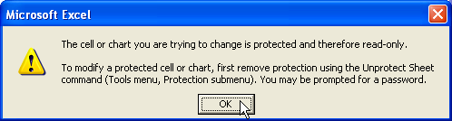
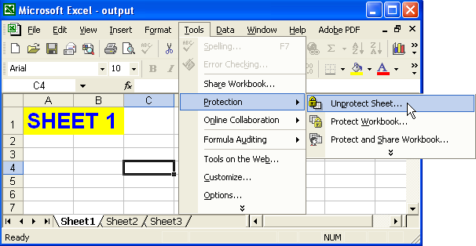
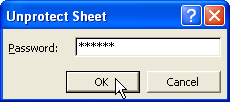
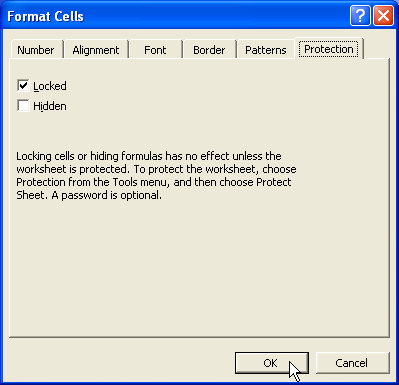

## **Protect Worksheets**

When a worksheet is protected, the actions a user can take are restricted. For example, they cannot input data, insert or delete rows or columns etc. The general protection options in Microsoft Excel are:

- Contents
- Objects
- Scenarios

Protected worksheets don't hide or protect sensitive data, so it's different from file encryption. Generally, worksheet protection is suitable for presentation purposes. It prevents the end user from modifying data, content and formatting in the worksheet.

### **Adding or Removing Protection**

Aspose.Cells provides a class, [**Workbook**](https://apireference.aspose.com/cells/java/com.aspose.cells/workbook), that represents a Microsoft Excel file. The Workbook class contains a WorksheetCollection that allows to access each worksheet in an Excel file. A worksheet is represented by the [**Worksheet**](https://apireference.aspose.com/cells/java/com.aspose.cells/worksheet) class.

The Worksheet class provides the [**Protect**](https://apireference.aspose.com/cells/java/com.aspose.cells/worksheet#protect(int)) method that is used to apply protection to a worksheet. The Protect method accepts the following parameters:

- Protection Type, the type of protection to apply on the worksheet. Protection type is applied with the help of the [**ProtectionType**](https://apireference.aspose.com/cells/java/com.aspose.cells/ProtectionType) enumeration.
- New Password, the new password used to protect the worksheet.
- Old Password, the old password, if the worksheet is already password protected. If the worksheet is not already protected then just pass a null.

The ProtectionType enumeration contains the following pre-defined protections types:

|**Protection Types**|**Description**|
| :- | :- |
|[**ALL**](https://apireference.aspose.com/cells/java/com.aspose.cells/protectiontype#ALL)|User cannot modify anything on this worksheet|
|[**CONTENTS**](https://apireference.aspose.com/cells/java/com.aspose.cells/protectiontype#CONTENTS)|User cannot enter data in this worksheet|
|[**OBJECTS**](https://apireference.aspose.com/cells/java/com.aspose.cells/protectiontype#OBJECTS)|User cannot modify drawing objects|
|[**SCENARIOS**](https://apireference.aspose.com/cells/java/com.aspose.cells/protectiontype#SCENARIOS)|User cannot modify saved scenarios|
|[**STRUCTURE**](https://apireference.aspose.com/cells/java/com.aspose.cells/protectiontype#STRUCTURE)|User cannot modify saved structure|
|[**WINDOWS**](https://apireference.aspose.com/cells/java/com.aspose.cells/protectiontype#WINDOWS)|User cannot modify saved windows|
|[**NONE**](https://apireference.aspose.com/cells/java/com.aspose.cells/protectiontype#NONE)|No protection|

The example below shows how to protect a worksheet with a password.



After the above code is used to protect the worksheet, check the protection on the worksheet by opening it. Once you open the file and try to add some data to the worksheet, the following dialog is displayed:

**A dialog warning that a user can't modify the worksheet** 

To work on the worksheet, unprotect the worksheet by selecting the **Protection**, then **Unprotect Sheet** from the **Tools** menu item as shown below.

**Selecting Unprotect Sheet menu item** 

A dialog opens prompting for a password.

**Entering password to unprotect the worksheet** 

### **Protecting a Few Cells**

There might be certain scenarios where you need to lock a few cells only in the worksheet. If you want to lock some specific cells in the worksheet, you have to unlock all the other cells in the worksheet. All the cells in a worksheet are already initialized for locking, you may check this opening any excel file into MS Excel and click the **Format | Cells...** to show **Format Cells** dialog box and then click the Protection tab and see a check box labeled "Locked" is checked by default.

Following are the two approaches to implement the task.

**Method1:**

The following points describe how to lock a few cells using MS Excel. This method applies to Microsoft Office Excel 97, 2000, 2002, 2003 and greater versions.

1. Select the entire worksheet by clicking the Select All button (the gray rectangle directly above the row number for row 1 and to the left of column letter A).
1. Click Cells on the Format menu, click the Protection tab, and then clear the Locked check box.

   This unlocks all the cells on the worksheet

{}

If the cells command is not available, parts of the worksheet may already be locked. On the Tools menu, point to Protection , and then click Unprotect Sheet .

{}

1. Select just the cells you want to lock and repeat step 2, but this time select the Locked check box.
1. On the **Tools** menu, select **Protection**, click **Protect Sheet**, and then click **OK**.

{}

In the Protect Sheet dialog box, you have the option to specify a password and select the elements that you want users to be able to change.

{}

**Method2:**

In this method, we use Aspose.Cells API only to do the task.

The following example exhibits how to protect a few cells in the worksheet. It unlocks all the cells in the worksheet first and then locks 3 cells (A1, B1, C1) in it. Finally, it protects the worksheet. A row / column has a Style API that further contains a set Locked method . You can use this method to lock or unlock the row / column.



### **Protect a Row in the Worksheet**

Aspose.Cells allows you to easily lock any row in the worksheet. Here, we can make use of [**applyStyle()**](https://apireference.aspose.com/cells/java/com.aspose.cells/row#applyStyle(com.aspose.cells.Style,%20com.aspose.cells.StyleFlag)) method of [**Row**](https://apireference.aspose.com/cells/java/com.aspose.cells/Row) class to apply Style to a particular row in the worksheet. This method takes two arguments: a [**Style**](https://apireference.aspose.com/cells/java/com.aspose.cells/Style) object and [**StyleFlag**](https://apireference.aspose.com/cells/java/com.aspose.cells/StyleFlag) struct which has all the members related to applied formatting.

The following example shows how to protect a row in the worksheet. It unlocks all the cells in the worksheet first and then locks the first row in it. Finally, it protects the worksheet. A row / column has a Style API that further contains a setCellLocked method . You can lock or unlock the row / column using the StyleFlag struct.



### **Protect a Column in the Worksheet**

Aspose.Cells allows you to easily lock any column in the worksheet. Here, we can make use of [**applyStyle()**](https://apireference.aspose.com/cells/java/com.aspose.cells/column#applyStyle(com.aspose.cells.Style,%20com.aspose.cells.StyleFlag)) method of [**Column**](https://apireference.aspose.com/cells/java/com.aspose.cells/Column) class to apply Style to a particular column in the worksheet. This method takes two arguments: a [**Style**](https://apireference.aspose.com/cells/java/com.aspose.cells/Style) object and [**StyleFlag**](https://apireference.aspose.com/cells/java/com.aspose.cells/StyleFlag) struct which has all the members related to applied formatting.

The following example shows how to protect a column in the worksheet. It unlocks all the cells in the worksheet first and then locks the first column in it. Finally, it protects the worksheet. A row / column has a Style API that further contains a set Locked method . You can lock or unlock the row / column using the StyleFlag struct.



## **Unprotect a Worksheet**

[Protecting Worksheets](/cells/java/protect-and-unprotect-worksheet/#protect-worksheets) and [Advanced Protection Settings since Excel XP](/cells/java/protect-and-unprotect-worksheet/#advanced-protection-settings-since-excel-xp) discussed different approaches of protecting worksheets. What if a developer needs to remove protection from a protected worksheet at runtime so that some changes can be made to the file? This can easily be done with Aspose.Cells.

### **Using Microsoft Excel**

To remove protection from a worksheet:

From the **Tools** menu, select **Protection** followed by **Unprotect Sheet**.

**Selecting Unprotect Sheet** 

Protection is removed, unless the worksheet is password protected. In this case, a dialog prompts for the password.

**Entering password to unprotect the worksheet** 

### **Using Aspose.Cells**

A worksheet can be unprotected by calling the [**Worksheet**](https://apireference.aspose.com/cells/java/com.aspose.cells/worksheet) class' [**Unprotect**](https://apireference.aspose.com/cells/java/com.aspose.cells/worksheet#unprotect()) method. The [**Unprotect**](https://apireference.aspose.com/cells/java/com.aspose.cells/worksheet#unprotect()) method can be used in two ways, described below.

### **Unprotecting a Simply Protected Worksheet**

A simply protected worksheet is one which is not protected with a password. Such worksheets can be unprotected by calling the unprotect method without passing a parameter.



### **Unprotecting a Password Protected Worksheet**

A password protected worksheet is one that is protected with a password. Such worksheets can be unprotected by calling an overloaded version of the Unprotect method that takes the password as a parameter.



## **Advanced Protection Settings since Excel XP**

[Protecting Worksheets](/cells/java/protect-and-unprotect-worksheet/#protect-worksheets) discussed protecting a worksheet in Microsoft Excel 97 and 2000. But since the release of Excel 2002 or XP, Microsoft has added many advanced protection settings. These protection settings restrict or allow users to:

- Delete rows or columns.
- Edit contents, objects or scenarios.
- Format cells, rows or columns.
- Insert rows, columns or hyperlinks.
- Select locked or unlocked cells.
- Use pivot tables and much more.

Aspose.Cells supports all the advanced protection settings offered by Excel XP and later versions.

### **Advanced Protection Settings Using Excel XP and Later Versions**

To view the protection settings available in Excel XP:

1. From the **Tools** menu, select **Protection** followed by **Protect Sheet**.
   A dialog is displayed.

   **Dialog to show protection options in Excel XP**

1. Allow or restrict worksheets features or apply a password.

### **Advanced Protection Settings Using Aspose.Cells**

Aspose.Cells support all of the advanced protection settings.

Aspose.Cells provides a class, [**Workbook**](https://apireference.aspose.com/cells/java/com.aspose.cells/workbook), that represents a Microsoft Excel file. The Workbook class contains a WorksheetCollection collection that allows access to each worksheet in the Excel file. A worksheet is represented by the [**Worksheet**](https://apireference.aspose.com/cells/java/com.aspose.cells/worksheet) class.

The Worksheet class provides the Protection property that is used to apply these advanced protection settings. The Protection property is in fact an object of the [**Protection**](https://apireference.aspose.com/cells/java/com.aspose.cells/protection) class that encapsulates several Boolean properties for disabling or enabling restrictions.



Below is a small example application. It opens an Excel file and uses most of the advanced protection settings supported by Excel XP and later versions.



{}

Save the file to EXCEL97TO2003 or XLSX format because these advanced protection settings are only supported by MS Excel XP and later versions.

{}

### **Cell Locking Issue**

If you want to restrict users from editing cells the cells must be locked before any protection settings are applied. Otherwise the cells can be edited even if worksheet is protected. In Microsoft Excel XP, cells can be locked through the following dialog:

**Dialog to lock cells in Excel XP** 

It is possible to lock cells using the Aspose.Cells API too. Each cell has a Style API that further contains a setLocked method. Use it lock or unlock cells.


